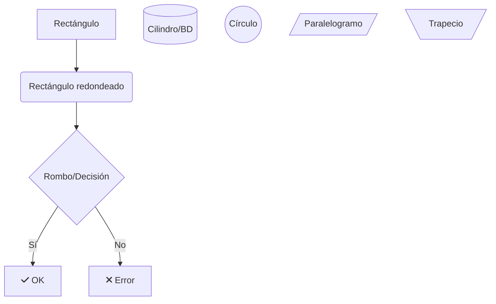
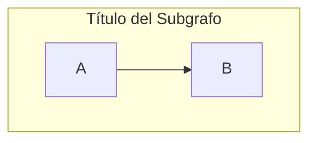
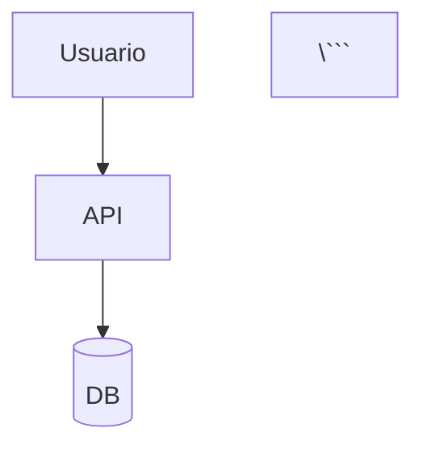

# 📐 Diagramas del Proyecto OpenPanel

## Archivos Disponibles

- `arquitectura-aplicacion.mmd` - Arquitectura de la aplicación OpenPanel
- `infraestructura-kubernetes.mmd` - Infraestructura Kubernetes en Minikube
- `flujo-cicd-gitops.mmd` - Flujo CI/CD completo con GitOps
- `flujo-datos-aplicacion.mmd` - Flujo de datos de la aplicación
- `blue-green-deployment.mmd` - Estrategia de deployment Blue-Green

---

## 🎨 Cómo Visualizar los Diagramas

### Opción 1: GitHub/GitLab (Recomendado)
Los archivos `.mmd` se renderizan automáticamente en GitHub y GitLab. Solo necesitas:
1. Hacer commit de estos archivos
2. Pushear a GitHub
3. Ver en el navegador

### Opción 2: Mermaid Live Editor (Online)
1. Ve a: https://mermaid.live/
2. Copia el contenido de cualquier archivo `.mmd`
3. Pégalo en el editor
4. **Exportar**: Click en "Actions" → "Download PNG" o "Download SVG"

### Opción 3: VSCode (Local)
1. Instalar extensión: [Mermaid Preview](https://marketplace.visualstudio.com/items?itemName=bierner.markdown-mermaid)
2. Abrir archivo `.mmd`
3. Click derecho → "Open Preview"
4. Para exportar: usar extensión [Markdown PDF](https://marketplace.visualstudio.com/items?itemName=yzane.markdown-pdf)

### Opción 4: Mermaid CLI (Terminal)
```bash
# Instalar
npm install -g @mermaid-js/mermaid-cli

# Convertir a PNG
mmdc -i arquitectura-aplicacion.mmd -o arquitectura-aplicacion.png

# Convertir a SVG (mejor calidad)
mmdc -i arquitectura-aplicacion.mmd -o arquitectura-aplicacion.svg

# Convertir todos
for file in *.mmd; do mmdc -i "$file" -o "${file%.mmd}.png"; done
```

---

## 📦 Exportar Todos a Imágenes (Automatizado)

### Script Bash

```bash
#!/bin/bash
# export-diagrams.sh

echo "📊 Exportando diagramas a PNG..."

# Verificar si mermaid-cli está instalado
if ! command -v mmdc &> /dev/null; then
    echo "Instalando @mermaid-js/mermaid-cli..."
    npm install -g @mermaid-js/mermaid-cli
fi

# Exportar cada diagrama
for file in *.mmd; do
    output="${file%.mmd}.png"
    echo "  Exportando $file → $output"
    mmdc -i "$file" -o "$output" -b transparent -w 2048
done

echo "✅ Exportación completada!"
ls -lh *.png
```

### Ejecutar
```bash
chmod +x export-diagrams.sh
./export-diagrams.sh
```

---

## 🖼️ Incrustar en el Brief Técnico

Una vez exportados a imágenes, añade al `Brief_tecnico.md`:

```markdown
## 3️⃣ Diagramas de Arquitectura

### Arquitectura de Aplicación OpenPanel


*Componentes principales de OpenPanel y sus interacciones: Dashboard (Next.js), API (Fastify), Worker (BullMQ), y bases de datos (PostgreSQL, ClickHouse, Redis).*

### Infraestructura Kubernetes en Minikube


*Organización de namespaces, deployments, statefulsets y persistent volumes en el cluster de Minikube.*

### Flujo CI/CD Completo con GitOps


*Pipeline completo desde el commit del developer hasta el deployment automático usando GitHub Actions y ArgoCD.*

### Flujo de Datos de la Aplicación


*Flujo de datos entre usuario, dashboard, API, workers y bases de datos, incluyendo observabilidad.*

### Blue-Green Deployment


*Estrategia de deployment Blue-Green con zero-downtime y rollback instantáneo.*
```

---

## 📝 Editar los Diagramas

Para modificar los diagramas:

1. **Sintaxis Mermaid**: https://mermaid.js.org/syntax/flowchart.html
2. **Ejemplos**: https://mermaid.js.org/ecosystem/integrations.html
3. **Live Editor**: https://mermaid.live/ (para probar cambios)

### Elementos Comunes



### Subgrafos



### Estilos

```mermaid
classDef myStyle fill:#3b82f6,stroke:#1e40af,color:#fff
class A,B myStyle
```

---

## 🎯 Tips para Mejores Diagramas

1. **Usa colores consistentes**:
   - 🔵 Azul: Frontend
   - 🟢 Verde: Backend
   - 🟣 Púrpura: Bases de datos
   - 🟠 Naranja: Networking/Ingress
   - 🟡 Amarillo: Observabilidad

2. **Mantén la jerarquía visual**: De arriba hacia abajo o de izquierda a derecha

3. **Agrupa elementos relacionados**: Usa subgrafos

4. **Etiqueta las conexiones**: Añade texto a las flechas

5. **Exporta en alta resolución**: `-w 2048` o `-w 4096`

---

## 🚀 Ejemplos de Uso

### En GitHub README
```markdown


### En Notion
Pegar el contenido del `.mmd` en un bloque de código Mermaid

### En Draw.io
1. Exportar a PNG desde Mermaid Live
2. Importar PNG en Draw.io como referencia
3. Recrear con herramientas de Draw.io

---

## 📊 Recursos Adicionales

- **Mermaid Docs**: https://mermaid.js.org/
- **Ejemplos**: https://mermaid.js.org/syntax/examples.html
- **Cheatsheet**: https://jojozhuang.github.io/tutorial/mermaid-cheat-sheet/
- **VSCode Extension**: https://marketplace.visualstudio.com/items?itemName=bierner.markdown-mermaid
