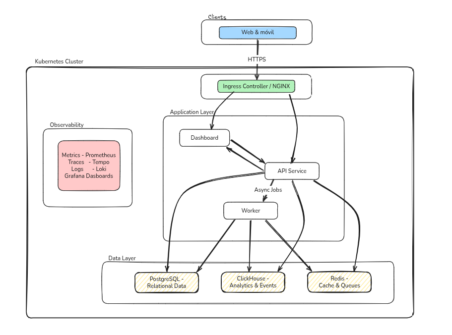
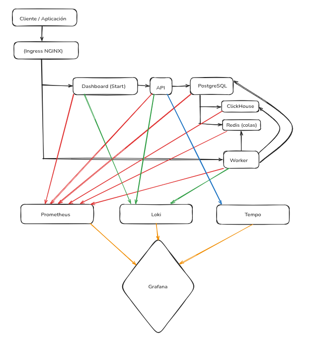
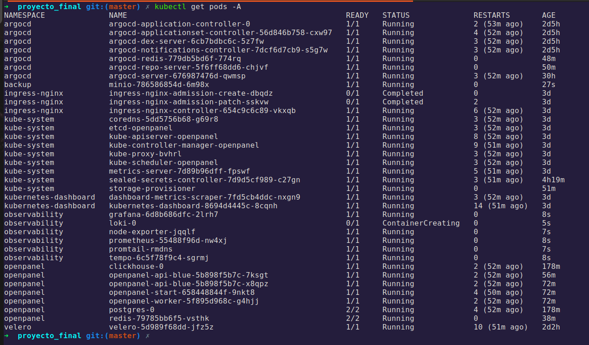
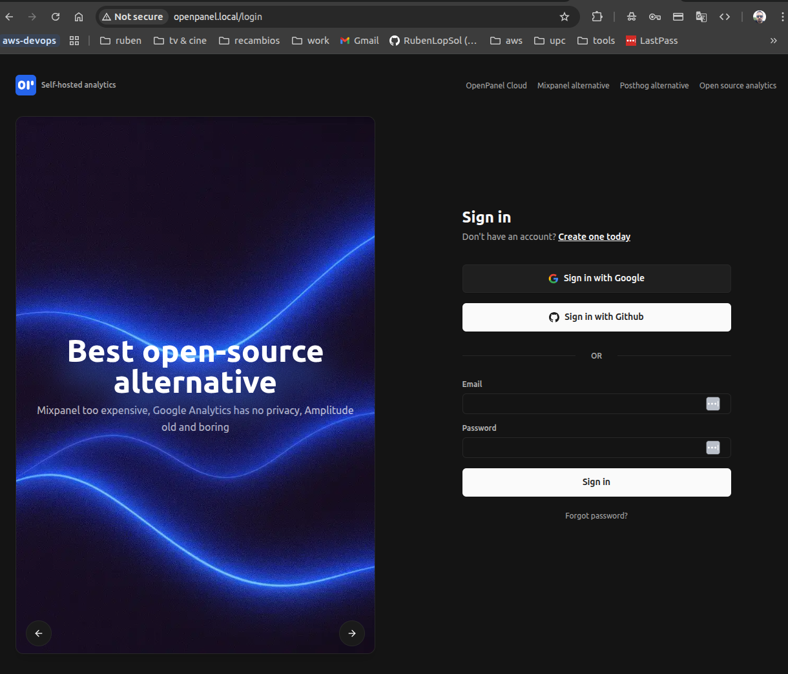
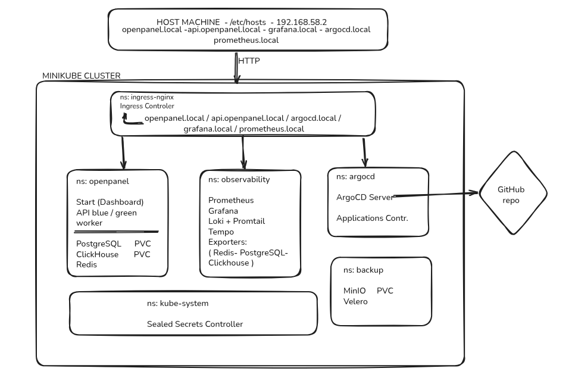

# Arquitectura del Sistema — OpenPanel en Kubernetes

**Proyecto Final — Master DevOps & Cloud Computing**

**Alumno:** Rubén López Solé 

**Especialidad:** GitOps

**Fecha:** Marzo 2026

---

## Visión General

OpenPanel es una plataforma de analítica web desplegada sobre un clúster local de Kubernetes (Minikube). La arquitectura separa claramente la ingesta de datos, el procesamiento y la visualización, con un stack de observabilidad completo y un flujo GitOps automatizado gestionado por ArgoCD.



---

## Servicios de la Aplicación

| Servicio | Imagen | Puerto | Descripción |
|---|---|---|---|
| **API** | `ghcr.io/rubenlopsol/openpanel-api` | 3000 | Recibe eventos y responde al Dashboard |
| **Dashboard (Start)** | `ghcr.io/rubenlopsol/openpanel-start` | 3000 | Interfaz web del usuario (Next.js) |
| **Worker** | `ghcr.io/rubenlopsol/openpanel-worker` | — | Procesamiento en segundo plano (BullMQ) |

### Bases de Datos

| Base de Datos | Tecnología | Puerto | Uso |
|---|---|---|---|
| **PostgreSQL** | StatefulSet | 5432 | Usuarios, proyectos, configuraciones |
| **ClickHouse** | StatefulSet | 8123 / 9000 | Eventos de analytics (volumen alto) |
| **Redis** | Deployment | 6379 | Colas de trabajo y caché |

---

## Flujo de Datos




---

## Namespaces de Kubernetes

| Namespace | Contenido |
|---|---|
| `openpanel` | API, Dashboard, Worker, PostgreSQL, ClickHouse, Redis |
| `observability` | Prometheus, Grafana, Loki, Promtail, Tempo, exporters |
| `argocd` | ArgoCD (GitOps controller) |
| `backup` | MinIO (object storage para backups) |
| `velero` | Velero (backup controller) |
| `ingress-nginx` | Ingress Controller |
| `sealed-secrets` | Sealed Secrets Controller |





---

## Estructura del Repositorio

```
proyecto_final/
├── .github/
│   └── workflows/
│       ├── ci-validate.yml     # CI-Lint-Test-Validate (gate de calidad)
│       ├── ci-build-publish.yml           # CI-Build-Publish (construye y publica imágenes)
│       └── cd-update-tags.yml  # CD-Update-GitOps-Manifests (actualiza tags en manifiestos)
├── .kube-linter.yaml           # Checks selectivos de kube-linter (CI)
├── .hadolint.yaml              # Reglas ignoradas de hadolint para Dockerfiles upstream (CI)
├── k8s/
│   ├── base/
│   │   ├── namespaces/     # Definición de namespaces
│   │   ├── openpanel/      # Manifiestos de la aplicación
│   ├── helm/values/        # Values files para Helm charts
│   │   └── backup/         # MinIO, Velero schedules
│   ├── overlays/
│   │   └── local/          # Overlay Minikube (resource limits patch)
│   └── argocd/
│       ├── applications/   # ArgoCD Application manifests
│       ├── projects/       # ArgoCD Project
│       └── sealed-secrets/ # Secrets cifrados
├── openpanel/              # Código fuente de la aplicación
└── docs/                   # Documentación del proyecto
```

---

## Infraestructura Kubernetes



### Componentes de Infraestructura

| Componente | Versión / Tecnología | Propósito |
|---|---|---|
| Minikube | v1.32+ | Clúster local de Kubernetes |
| Kubernetes | v1.28 | Orquestación de contenedores |
| Ingress NGINX | helm chart | Exposición de servicios |
| ArgoCD | v2.x (Helm chart) | GitOps controller |
| kube-prometheus-stack | Helm chart | Prometheus + Grafana + Node Exporter |
| Loki | Helm chart | Agregación de logs |
| Promtail | Helm chart | Recolección de logs (DaemonSet) |
| Tempo | Helm chart | Distributed tracing |
| Sealed Secrets | helm chart | Gestión segura de secrets |
| Velero | v1.x | Backup y restauración |
| MinIO | latest | Object storage para backups |

---

## Decisiones de Diseño

### ¿Por qué Kustomize y no Helm?
Kustomize permite mantener manifiestos YAML puros versionados en Git, sin abstracciones adicionales. Los overlays permiten personalizar el clúster local sin duplicar configuración.

La principal ventaja es poder soportar múltiples entornos (local, staging, producción) con el **mínimo código posible**, modificando únicamente lo que cambia en cada uno:

```
k8s/
├── base/              → configuración común a todos los entornos (se escribe una sola vez)
└── overlays/
    ├── local/         → solo lo que cambia en Minikube (menos recursos)
    ├── staging/       → solo lo que cambia en staging (réplicas, URLs)
    └── production/    → solo lo que cambia en producción (recursos completos, HPA)
```

Cada overlay únicamente define sus diferencias respecto a `base/`. No se repite ningún YAML. Si hay que cambiar algo común a todos los entornos, se cambia una sola vez en `base/` y todos los overlays lo heredan automáticamente.

### ¿Por qué ArgoCD para CD?
ArgoCD implementa el modelo GitOps puro: el estado del clúster siempre converge hacia lo que está en Git. Permite rollbacks inmediatos y auditabilidad completa de despliegues.

### ¿Por qué Blue-Green solo en la API?
La API es el componente más crítico del sistema (punto de entrada de todos los eventos). Blue-Green garantiza zero-downtime y rollback en segundos. Dashboard y Worker tienen menor impacto en disponibilidad.

### ¿Por qué Sealed Secrets?
En GitOps, todo debe estar en Git — incluyendo secrets. Sealed Secrets cifra los secretos con la clave pública del clúster, permitiendo commitearlos de forma segura. Solo el controlador del clúster puede descifrarlos.
