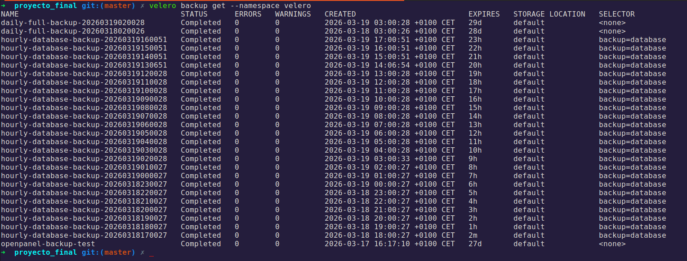

# Backup and Recovery — Velero + MinIO

**Final Project — Master in DevOps & Cloud Computing**

---

## Backup Strategy

The backup system consists of two components:

| Component | Technology | Namespace | Role |
|---|---|---|---|
| **MinIO** | Deployment + PVC | `backup` | S3-compatible object storage (backup storage) |
| **Velero** | Deployment + CRDs | `velero` | Kubernetes backup orchestration (BackupStorageLocation, Schedule) |

---

## Backup Schedules

Schedules follow the same base/overlay structure as the rest of the infrastructure:

- **Base** (`k8s/infrastructure/base/backup/velero/schedule.yaml`): daily full backup — applied to all environments.
- **Prod overlay** (`k8s/infrastructure/overlays/prod/resources/velero-schedule-hourly.yaml`): hourly database backup — production only.

### Daily Full Backup (all environments)

```yaml
apiVersion: velero.io/v1
kind: Schedule
metadata:
  name: daily-full-backup
  namespace: backup
spec:
  schedule: "0 2 * * *"   # Every day at 2:00 AM
  template:
    includedNamespaces:
      - openpanel
      - observability
    ttl: 720h0m0s          # Retention: 30 days
    storageLocation: default
```

### Hourly Database Backup (production only)

```yaml
apiVersion: velero.io/v1
kind: Schedule
metadata:
  name: hourly-database-backup
  namespace: backup
spec:
  schedule: "0 * * * *"   # Every hour
  template:
    includedNamespaces:
      - openpanel
    labelSelector:
      matchLabels:
        backup: database   # Only resources with this label
    ttl: 24h0m0s           # Retention: 24 hours
    storageLocation: default
```

### Policy Summary

| Schedule | Frequency | Scope | Retention |
|---|---|---|---|
| `daily-full-backup` | Daily (02:00 AM) | `openpanel` + `observability` | 30 days |
| `hourly-database-backup` | Every hour | Pods with `backup: database` in `openpanel` | 24 hours |

---

## MinIO — Backup Storage

MinIO acts as a local S3 server where Velero stores backups.

### Accessing the MinIO console

```bash
# Port-forward to MinIO
kubectl port-forward svc/minio -n backup 9000:9000 9001:9001
# Web console: http://localhost:9001
```

### Verifying the backup bucket

```bash
# View objects stored in MinIO
kubectl exec -n backup deployment/minio -- \
  mc ls local/velero-backups/
```

---

## Operations Script — `backup-restore.sh`

The repository includes a script that simplifies backup and restore operations:

```bash
# View help and available actions
./scripts/backup-restore.sh help
```

### Available actions

| Command | Description |
|---|---|
| `./scripts/backup-restore.sh backup [namespace]` | Full backup of a namespace via Velero (default: `openpanel`) |
| `./scripts/backup-restore.sh backup-db` | Direct backup of PostgreSQL (`pg_dump`), Redis snapshot (`SAVE`) and native ClickHouse backup (`BACKUP DATABASE`) |
| `./scripts/backup-restore.sh restore <backup-name>` | Restore from a specific Velero backup |
| `./scripts/backup-restore.sh list` | List all available backups |

### Usage examples

```bash
# Full backup of the openpanel namespace
./scripts/backup-restore.sh backup openpanel

# Direct backup of PostgreSQL, Redis and ClickHouse (without Velero)
./scripts/backup-restore.sh backup-db
# Generates: backup-postgres-<timestamp>.sql.gz in the local directory
# Redis:   triggers a SAVE to force the RDB snapshot
# ClickHouse: BACKUP DATABASE openpanel TO File('backup-clickhouse-<timestamp>.zip')

# List available backups
./scripts/backup-restore.sh list

# Restore from a specific backup
./scripts/backup-restore.sh restore manual-backup-20260318-143000
```

> The `backup-db` command runs `pg_dump` directly on the PostgreSQL pod, triggers the Redis RDB snapshot, and uses the native ClickHouse mechanism (`BACKUP DATABASE ... TO File(...)`) preceded by `SYSTEM FLUSH LOGS` to guarantee consistency of in-memory data. Useful for quick point-in-time backups without relying on Velero.

---

## Manual Backup Commands (without script)

### Creating a point-in-time backup

```bash
# Full backup of openpanel
velero backup create backup-manual-$(date +%Y%m%d) \
  --include-namespaces openpanel \
  --namespace velero

# Database-only backup
velero backup create db-backup-$(date +%Y%m%d-%H%M) \
  --include-namespaces openpanel \
  --selector backup=database \
  --namespace velero
```

### Viewing available backups



```bash
# List all backups
velero backup get --namespace velero

# View details of a specific backup
velero backup describe daily-full-backup-<timestamp> \
  --namespace velero

# View backup logs
velero backup logs daily-full-backup-<timestamp> \
  --namespace velero
```

---

## Restore Procedure

### Restoring from the latest full backup

```bash
# 1. View available backups
velero backup get --namespace velero

# 2. Create the restore
velero restore create \
  --from-backup daily-full-backup-<timestamp> \
  --namespace velero

# 3. Monitor progress
velero restore describe \
  daily-full-backup-<timestamp>-<restore-timestamp> \
  --namespace velero

# 4. Verify that pods have started
kubectl get pods -n openpanel
```

### Restoring only the databases

```bash
# Restore only the database resources
velero restore create \
  --from-backup hourly-database-backup-<timestamp> \
  --include-namespaces openpanel \
  --selector backup=database \
  --namespace velero
```

### Restoring to a different namespace

```bash
# Restore openpanel to openpanel-restore for verification
velero restore create \
  --from-backup daily-full-backup-<timestamp> \
  --namespace-mappings openpanel:openpanel-restore \
  --namespace velero
```

---

## Verifying the Backup System

```bash
# View status of configured schedules
velero schedule get --namespace velero

# Verify the storage location
velero backup-location get --namespace velero

# Verify that MinIO is accessible
kubectl get pods -n backup
kubectl logs -n backup deployment/minio

# View the latest completed backup
velero backup get --namespace velero | head -5
```

---

## Troubleshooting

| Problem | Diagnosis | Solution |
|---|---|---|
| Backup in `PartiallyFailed` state | `velero backup describe <name>` | Check which resources failed and whether they have PVCs without a snapshot |
| Velero cannot connect to MinIO | `kubectl logs -n velero deployment/velero` | Verify credentials and MinIO URL in BackupStorageLocation |
| Schedule not running | `kubectl get schedule -n velero` | Verify that the `velero` namespace exists and the schedule is `Enabled` |
| Incomplete restore | `velero restore describe <name>` | Some PVs may already exist; use `--existing-resource-policy update` |

---

## Implementation Notes

> **IMPORTANT:** Velero has its **own `velero` namespace**, separate from the `backup` namespace where MinIO lives. All `velero` commands must use `--namespace velero`.

```bash
# CORRECT
velero backup get --namespace velero
velero schedule get --namespace velero

# INCORRECT (will not work — backup is MinIO's namespace, not Velero's)
velero backup get --namespace backup
```
