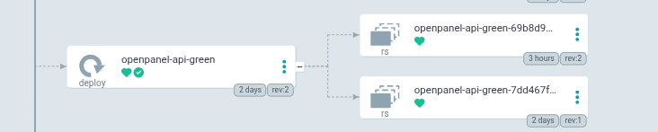
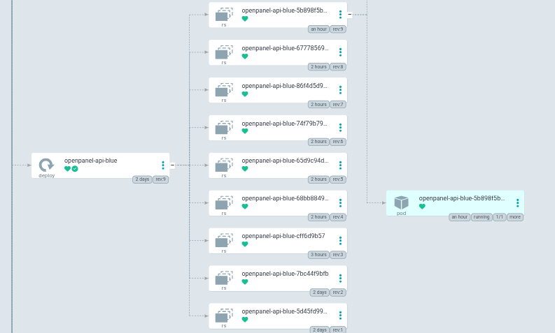

# Blue-Green Deployment — Zero-Downtime Deployment Strategy

**Final Project — Master in DevOps & Cloud Computing**

---

## What is Blue-Green and why use it for the API

The Blue-Green strategy maintains **two deployment versions** simultaneously active:

- **Blue** — currently in production, receives all traffic
- **Green** — new candidate version, deployed and verified before receiving traffic

The switch is performed by changing the **Kubernetes Service selector**, which redirects traffic instantly without interruptions.

It is applied exclusively to the **API** service because it is the most critical component: it is the entry point for all analytics events and handles Dashboard requests.


---

## Manifest Architecture

### Two simultaneous Deployments

```
k8s/apps/base/openpanel/
├── api-deployment-blue.yaml    ← Blue version (active)
├── api-deployment-green.yaml   ← Green version (standby)
└── api-service.yaml            ← Service (selector points to Blue or Green)
```

### Blue Deployment

```yaml
apiVersion: apps/v1
kind: Deployment
metadata:
  name: openpanel-api-blue
  namespace: openpanel
spec:
  replicas: 2
  selector:
    matchLabels:
      app: openpanel-api
      version: blue
  template:
    metadata:
      labels:
        app: openpanel-api
        version: blue
    spec:
      containers:
        - name: api
          image: ghcr.io/rubenlopsol/openpanel-api:main-dfc2ddf
```

### Green Deployment

```yaml
apiVersion: apps/v1
kind: Deployment
metadata:
  name: openpanel-api-green
  namespace: openpanel
spec:
  replicas: 0   ← On standby when not active
  selector:
    matchLabels:
      app: openpanel-api
      version: green
```

### Service (active selector)

```yaml
apiVersion: v1
kind: Service
metadata:
  name: openpanel-api
  namespace: openpanel
spec:
  selector:
    app: openpanel-api
    version: blue    ← ← ← this is the switch
  ports:
    - port: 3000
      targetPort: 3000
```

---

## Switch Script — `blue-green-switch.sh`

The repository includes a script that automates the entire switch process with integrated health checks:

```bash
./scripts/blue-green-switch.sh
```

The script automatically detects the active version and executes the following steps in order:

| Step | Action |
|---|---|
| 1 | Detects the current active version (Blue or Green) |
| 2 | Scales the target deployment to 2 replicas |
| 3 | Waits for the rollout to complete (`--timeout=300s`) |
| 4 | Verifies that all target pods are in `Running` and `Ready` state |
| 5 | Asks for confirmation before switching traffic |
| 6 | Updates the Service selector with `kubectl patch` |
| 7 | Shows active endpoints to confirm the switch |
| 8 | Asks whether to scale the old deployment to 0 (optional, for fast rollback) |

If the health check in step 4 fails, the script **automatically aborts** and scales the target deployment to 0, without having touched traffic at any point.

At the end, it prints the instant rollback command in case it is needed.

---

## Blue-Green Deployment Flow

### Initial state
- Blue is active with version `v1.0` and receives all traffic
- Green has `replicas: 0` (consumes no resources)

### Step 1 — CD updates the image in Blue

The CD pipeline updates the tag in `api-deployment-blue.yaml` (the default active slot):

```bash
# CD pipeline updates the tag in Blue (active slot)
image: ghcr.io/rubenlopsol/openpanel-api:main-abc1234
```

ArgoCD deploys the new version to Blue via rolling update. Blue receives the new code while still in production.

To use the full Blue-Green model (deploy to Green first, verify, then switch), manually update the tag in `api-deployment-green.yaml` before running the switch script.

### Step 2 — Scale Green and verify

```bash
# Scale Green so the new version starts
kubectl scale deployment openpanel-api-green \
  -n openpanel --replicas=2

# Verify that Green pods are Running
kubectl get pods -n openpanel -l version=green

# Check logs (look for startup errors)
kubectl logs -n openpanel -l version=green --tail=50

# Quick health test (port-forward directly to the Green pod)
kubectl port-forward -n openpanel \
  deployment/openpanel-api-green 3001:3000
curl http://localhost:3001/health
```

### Step 3 — Switch traffic to Green

```bash
# Change the Service selector to Green
kubectl patch service openpanel-api -n openpanel \
  -p '{"spec":{"selector":{"app":"openpanel-api","version":"green"}}}'

# Verify that the Service points to Green
kubectl get service openpanel-api -n openpanel \
  -o jsonpath='{.spec.selector}'
```



### Step 4 — Verify the switch

```bash
# Verify Service endpoints (should be the Green pods)
kubectl get endpoints openpanel-api -n openpanel

# Monitor metrics in Grafana (error rate, latency)
# Dashboard: OpenPanel K8s Monitoring → "API Request Rate"
```

### Step 5 — Clean up Blue (optional)

Once it is confirmed that Green is working correctly:

```bash
# Reduce Blue to 0 replicas to free up resources
kubectl scale deployment openpanel-api-blue \
  -n openpanel --replicas=0
```

---

## Rollback

If a problem is detected in the new version, rollback is immediate:

```bash
# Return traffic to Blue with a single command
kubectl patch service openpanel-api -n openpanel \
  -p '{"spec":{"selector":{"app":"openpanel-api","version":"blue"}}}'
```

Rollback takes **less than 5 seconds** — no redeployment is needed and there is no wait for new pods to start (Blue was already running).

---

## Integration with ArgoCD



In the GitOps model, the Service selector change must also be reflected in Git:

```bash
# Edit api-service.yaml in the repository
# Change: version: blue → version: green
git add k8s/apps/base/openpanel/api-service.yaml
git commit -m "feat: switch API traffic to green (v1.2.0)"
git push
# ArgoCD applies the change automatically
```

For rollback via GitOps:

```bash
# Revert the Service commit
git revert HEAD
git push
# ArgoCD restores the selector to Blue
```

---

## Command Summary

| Action | Command |
|---|---|
| View active version | `kubectl get svc openpanel-api -n openpanel -o jsonpath='{.spec.selector.version}'` |
| Scale Green | `kubectl scale deployment openpanel-api-green -n openpanel --replicas=2` |
| Switch to Green | `kubectl patch svc openpanel-api -n openpanel -p '{"spec":{"selector":{"version":"green"}}}'` |
| Rollback to Blue | `kubectl patch svc openpanel-api -n openpanel -p '{"spec":{"selector":{"version":"blue"}}}'` |
| View pods by version | `kubectl get pods -n openpanel -l version=blue` |
