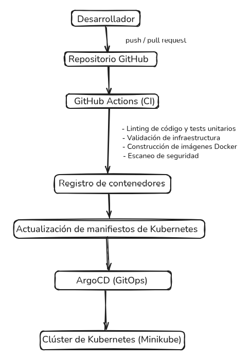

# CI/CD — Pipeline de Integración y Despliegue Continuo

**Proyecto Final — Master DevOps & Cloud Computing**

---

## Visión General

El pipeline CI/CD está implementado con **GitHub Actions** y sigue este flujo:

```
Developer pushes code / opens PR
           │
           ▼
  ci-validate.yml                    ← disparado por push o pull_request
  CI-Lint-Test-Validate
  ├── lint-and-test    (comentado — deshabilitado, ver nota)
  ├── validate-infra
  └── secret-scan
           │
           │ termina con éxito
           ▼
  ci-build-publish.yml                          ← disparado por workflow_run sobre ci-validate.yml
  CI-Build-Publish               ← SÓLO en master/main, nunca en PRs
  └── build-and-push
      └── security-scan
           │
           │ termina con éxito
           ▼
  cd-update-tags.yml                 ← disparado por workflow_run sobre ci-build-publish.yml
  CD-Update-GitOps-Manifests
  └── update-manifests
      └── hace commit con los nuevos image tags en Git
           │
           ▼
      ArgoCD detecta el nuevo commit
      y despliega automáticamente
```

> En una **Pull Request** la cadena se detiene tras `ci-validate.yml`. `ci-build-publish.yml` sólo se activa en `master`/`main`, por lo que las PRs nunca construyen ni publican imágenes.



---


---

## Por qué hay tres archivos de workflow

El pipeline está dividido en tres archivos con responsabilidades distintas. Esto no es una preferencia estética — tiene una razón técnica y de coste:

| Archivo | Nombre | Responsabilidad |
|---|---|---|
| `ci-validate.yml` | `CI-Lint-Test-Validate` | Gate de calidad: valida el código antes y después de mergear |
| `ci-build-publish.yml` | `CI-Build-Publish` | Construye y publica las imágenes Docker en GHCR |
| `cd-update-tags.yml` | `CD-Update-GitOps-Manifests` | Actualiza los tags de imagen en los manifiestos de Kubernetes |

**El motivo central es la separación entre validación y publicación.**

Mezclar lint, tests y build en un solo archivo tiene un problema: en cada Pull Request se ejecutarían los pasos de build y push aunque el código no vaya a mergearse todavía. Eso significa publicar imágenes Docker de ramas en desarrollo en el registry de producción, consumir minutos de runner innecesariamente y generar ruido en el historial de imágenes.

Al separarlo, el comportamiento es el correcto:

- `ci-validate.yml` corre en **todas** las PRs y en cada push — valida los manifiestos de Kubernetes y escanea secrets, y actúa como barrera antes de que nada llegue a master.
- `ci-build-publish.yml` sólo corre **después** de que `ci-validate.yml` pasa en master — es el único momento en que tiene sentido publicar una imagen al registry.
- `cd-update-tags.yml` sólo corre **después** de que `ci-build-publish.yml` termina — actualiza los manifiestos con el nuevo tag para que ArgoCD lo despliegue.

---

# Pipeline CI — `ci-validate.yml`

Nombre: **`CI-Lint-Test-Validate`**

Se ejecuta en tres situaciones:

| Trigger | Cuándo | Por qué |
|---|---|---|
| `pull_request` | Al abrir o actualizar una PR hacia `master`/`main` | Valida el código **antes** de mergear — es el gate de calidad |
| `push` | Al mergear a `master`/`main` | Validación **después** de mergear y punto de arranque de la cadena hacia `ci-build-publish.yml` |
| `workflow_dispatch` | Manual desde la UI de GitHub Actions | Permite lanzar el pipeline sin necesidad de hacer un push |

Los cambios que sólo afectan a documentación (`**.md`, `docs/**`, `.gitignore`) no lanzan el pipeline.

### Por qué corre en PR y también en push a master

Puede parecer redundante ejecutar la misma validación dos veces, pero hay tres razones concretas:

**1. Es el arranque de la cadena.**
`ci-build-publish.yml` se activa mediante `workflow_run` escuchando a `ci-validate.yml`. Si `ci-validate.yml` no corriese en push a master, `ci-build-publish.yml` nunca tendría un evento al que reaccionar — la cadena entera se rompería.

**2. Protege contra pushes directos a master.**
Si alguien hace push directamente a master sin pasar por una PR, la validación en `pull_request` nunca se ejecutó. El trigger `push` garantiza que el código se valida igualmente.

**3. Valida el resultado del merge, no sólo la rama.**
Cuando una PR se aprueba, el CI validó la rama de desarrollo. Pero el merge en sí puede introducir conflictos o cambios inesperados. El trigger `push` valida el estado final de master tras el merge.

### Jobs del pipeline

```
CI-Lint-Test-Validate
├── lint-and-test          ← DESHABILITADO (comentado intencionalmente — ver nota)
├── validate-infra         ← Paralelo
└── secret-scan            ← Paralelo
```

> **Nota — `lint-and-test` deshabilitado intencionalmente:** Este es un proyecto DevOps, no un proyecto de aplicación. El linting, type-checking y testing del código de OpenPanel son responsabilidad del equipo de aplicación, no del pipeline de infraestructura. El job está comentado en `ci-validate.yml` (no eliminado) para que pueda reactivarse si el proyecto toma ownership del código fuente. El CI aquí se centra en lo que importa para DevOps: manifiestos Kubernetes válidos y seguros, y ausencia de secrets expuestos.

---

# Pipeline Build — `ci-build-publish.yml`

Nombre: **`CI-Build-Publish`**

Se lanza automáticamente cuando `CI-Lint-Test-Validate` termina con éxito en `master`/`main`. No tiene trigger manual propio — si necesitas lanzarlo manualmente, dispara `ci-validate.yml` desde la UI y si pasa, el build se lanza automáticamente a través de la cadena. Esto garantiza que el gate de validación nunca se salta.

### Jobs del pipeline

```
CI-Build-Publish
└── build-and-push         ← Se ejecuta si el gate CI pasó con éxito
    └── security-scan      ← Depende de build-and-push
```

---

### Job: Lint & Test (App) — DESHABILITADO

Este job está **comentado intencionalmente** en `ci-validate.yml`. El motivo: este es un proyecto DevOps cuyo objetivo es desplegar y operar la aplicación OpenPanel de forma fiable, no mantener su código fuente. El linting de la aplicación (ESLint, TypeScript, tests unitarios) es responsabilidad del equipo de aplicación.

El código del job permanece comentado en el workflow para que pueda reactivarse si el proyecto toma ownership del código fuente de OpenPanel.

---

### Job: Validate Infrastructure

Las herramientas se instalan directamente desde sus releases oficiales con versiones fijadas — sin depender de Actions de terceros como Azure. kubectl incluye verificación de checksum SHA256 para garantizar integridad del binario.

Las versiones están declaradas en el bloque `env:` del job — definidas una sola vez en la parte superior, sin valores hardcodeados en cada comando `curl`. Para actualizar una versión basta con cambiar una línea.

```yaml
env:
  KUBECTL_VERSION: "v1.28.0"
  KUSTOMIZE_VERSION: "v5.3.0"
  KUBECONFORM_VERSION: "v0.6.4"
  KUBE_LINTER_VERSION: "v0.6.4"
  HADOLINT_VERSION: "v2.12.0"
```

| Herramienta | Versión | Fuente de instalación |
|---|---|---|
| `kubectl` | `v1.28.0` | `dl.k8s.io` (oficial de Kubernetes) + verificación SHA256 |
| `kustomize` | `v5.3.0` | GitHub releases (`kubernetes-sigs/kustomize`) |
| `kubeconform` | `v0.6.4` | GitHub releases (`yannh/kubeconform`) |
| `kube-linter` | `v0.6.4` | GitHub releases (`stackrox/kube-linter`) |
| `hadolint` | `v2.12.0` | GitHub releases (`hadolint/hadolint`) |

| Paso | Herramienta | Qué valida |
|---|---|---|
| `kustomize build k8s/overlays/local` | Kustomize v5.3.0 | Los overlays generan YAML válido |
| `kubeconform` (verbose, strict) | kubeconform v0.6.4 | Los manifiestos cumplen los schemas de Kubernetes 1.28 |
| `kube-linter lint --config .kube-linter.yaml` | kube-linter v0.6.4 | Checks selectivos definidos en `.kube-linter.yaml` (ver detalle abajo) |
| `hadolint --failure-threshold error` | hadolint v2.12.0 | Lint de Dockerfiles (API, Start, Worker) — solo errores bloquean el pipeline, los warnings se ignoran |

> **No se usa `kubectl apply --dry-run=client`** — se eliminó del pipeline porque requería un kubeconfig real o simulado para conectar con el API server. kubeconform cubre la validación de schema de forma más robusta y sin dependencias de clúster.

#### Configuración de kube-linter — `.kube-linter.yaml`

El archivo `.kube-linter.yaml` en la raíz del repositorio define un conjunto **selectivo** de checks en lugar de activar todos los built-in:

| Modo | Valor |
|---|---|
| `addAllBuiltIn` | `false` — solo corren los checks explícitamente incluidos |

| Check incluido | Qué detecta |
|---|---|
| `latest-tag` | Imágenes usando el tag `latest` (no reproducible) |
| `unset-cpu-requirements` | Contenedores sin `resources.requests/limits` de CPU |
| `unset-memory-requirements` | Contenedores sin `resources.requests/limits` de memoria |
| `privilege-escalation-container` | Contenedores sin `allowPrivilegeEscalation: false` |
| `writable-host-mount` | Volúmenes montados desde el host con permisos de escritura |

Checks **excluidos explícitamente** (con justificación):

| Check excluido | Motivo |
|---|---|
| `no-anti-affinity` | Clúster Minikube de un solo nodo — anti-affinity no aplica |
| `no-read-only-root-fs` | Las bases de datos (postgres, clickhouse) y los init containers necesitan filesystem escribible |
| `run-as-non-root` | El init container `fix-permissions` debe correr como root para hacer `chown` de los volúmenes |
| `non-isolated-pod` | Las Network Policies se gestionan en manifiestos separados, no en los deployments |

#### Configuración de hadolint — `.hadolint.yaml`

El archivo `.hadolint.yaml` en la raíz ignora dos reglas de los Dockerfiles upstream que no son responsabilidad del proyecto:

| Regla ignorada | Descripción |
|---|---|
| `DL3008` | Pin de versiones en `apt-get install` — código upstream, no es responsabilidad del pipeline |
| `DL3059` | Instrucciones `RUN` consecutivas sin consolidar — código upstream, no es responsabilidad del pipeline |

Con `--failure-threshold error`, hadolint **solo bloquea el pipeline** si encuentra errores reales (p.ej. sintaxis incorrecta en el Dockerfile). Los warnings, incluidos los ignorados vía `.hadolint.yaml`, no interrumpen la build.

---

### Job: Secret Detection

Ejecutado con **Gitleaks** sobre todo el historial del repositorio (`fetch-depth: 0`).

- Detecta tokens, contraseñas y keys en texto plano
- Bloquea el pipeline si encuentra secrets expuestos

---

### Job: Build & Push Images

**Solo se ejecuta en push a `main`/`master`** (no en PRs).

#### Actions reutilizables (`uses`)

GitHub Actions permite reutilizar acciones predefinidas publicadas por terceros. En lugar de programar cada paso desde cero, se llaman con `uses: autor/action@version` y se configuran con `with:`.

Las actions usadas en este job:

| Action | Autor | Qué hace |
|---|---|---|
| `actions/checkout@v4` | GitHub | Descarga el código del repositorio en la máquina virtual |
| `docker/login-action@v3` | Docker | Hace login en GHCR usando las credenciales proporcionadas |
| `docker/setup-buildx-action@v3` | Docker | Configura el motor de build avanzado de Docker (multi-plataforma, cache) |
| `docker/metadata-action@v5` | Docker | Calcula automáticamente los tags de la imagen según el tipo de push (SHA, latest, semver, PR) |
| `docker/build-push-action@v5` | Docker | Construye la imagen Docker y la sube al registry con los tags calculados |

> `docker/metadata-action` es la pieza clave: mira el contexto del evento (push normal, tag de versión, PR) y decide qué tags aplicar automáticamente. Su resultado se pasa al paso siguiente mediante `${{ steps.meta.outputs.tags }}`.

Construye y publica 3 imágenes en paralelo mediante `strategy.matrix`:

| Servicio | Imagen publicada en GHCR |
|---|---|
| `api` | `ghcr.io/rubenlopsol/openpanel-api` |
| `start` | `ghcr.io/rubenlopsol/openpanel-start` |
| `worker` | `ghcr.io/rubenlopsol/openpanel-worker` |

### Estrategia de tags

| Trigger | Tag generado |
|---|---|
| Push a main | `main-<sha7>` (ej: `main-dfc2ddf`) |
| Push a main | `latest` |
| Tag semver | `v1.2.3` |
| Pull Request | `pr-<número>` |

### Cache de Docker

Se utiliza GitHub Actions Cache (`type=gha`) para acelerar las builds:

```yaml
cache-from: type=gha
cache-to: type=gha,mode=max
```

---

### Job: Generate SBOM

**anchore/sbom-action** genera un Software Bill of Materials (SBOM) para cada una de las 3 imágenes publicadas, en formato SPDX-JSON.

- Se ejecuta dentro del mismo job `build-and-push`, justo después de publicar la imagen
- El SBOM se sube como artefacto del workflow con retención de 5 días
- Permite auditar exactamente qué paquetes y dependencias contiene cada imagen publicada
- Es un requisito en pipelines modernos de supply chain security (SLSA, SSDF)

---

### Job: Security Scan

**Trivy** escanea las 3 imágenes publicadas en busca de vulnerabilidades `CRITICAL` y `HIGH`.

- Los resultados se suben como SARIF a GitHub Security Tab con `if: always()` — el SARIF se sube incluso si Trivy falla
- `exit-code: "1"` — el step falla si se encuentran vulnerabilidades con parche disponible
- `ignore-unfixed: true` — ignora vulnerabilidades sin parche publicado (no se pueden corregir localmente)

---

# Pipeline CD — `cd-update-tags.yml`


El pipeline CD se ejecuta automáticamente **cuando el CI termina con éxito**.

### Trigger

```yaml
on:
  workflow_run:
    workflows: ["CI-Build-Publish"]
    types: [completed]
    branches: [master, main]
```

### Job: Update Image Tags

Este job actualiza los manifiestos de Kubernetes directamente en Git:

```bash
# 1. Actualiza el tag de imagen en los 3 deployments
sed -i "s|image: ghcr.io/.*/openpanel-api:.*|image: ghcr.io/<owner>/openpanel-api:main-<sha>|g" \
  k8s/base/openpanel/api-deployment-blue.yaml
# (igual para start-deployment.yaml y worker-deployment.yaml)

# 2. Actualiza el targetRevision de la ArgoCD Application al nuevo release tag
sed -i "s|targetRevision:.*|targetRevision: release/main-<sha>|" \
  k8s/argocd/applications/openpanel-app.yaml

# 3. Commit con todos los cambios (imagen + ArgoCD Application)
git commit -m "chore: update image tags to main-<sha>"
git push

# 4. Crea y push del tag de release (referencia inmutable al despliegue)
git tag "release/main-<sha>"
git push origin "release/main-<sha>"
```

ArgoCD bootstrap detecta el cambio en `openpanel-app.yaml` (que ahora apunta al tag `release/main-<sha>`) y re-aplica la Application. ArgoCD entonces sincroniza openpanel desde ese tag exacto — el commit que contiene los image tags actualizados.

El tag `release/main-<sha>` es inmutable. Para hacer rollback a cualquier versión anterior, basta con actualizar `targetRevision` en `openpanel-app.yaml` al tag correspondiente y hacer push.

---

## Estrategia de Versionado

El proyecto sigue **Semantic Versioning (SemVer)** para releases oficiales.

| Tipo de cambio | Tag de versión | Ejemplo |
|---|---|---|
| Release de producción | `vMAJOR.MINOR.PATCH` | `v1.2.0` |
| Build de desarrollo | `main-<sha7>` | `main-dfc2ddf` |
| Pull Request | `pr-<num>` | `pr-42` |

---

## Permisos del Pipeline

Cada workflow declara `permissions: read-all` a nivel de workflow como restricción por defecto. Los jobs que necesitan más permisos los declaran explícitamente en su bloque `permissions:`, sobreescribiendo sólo lo necesario.

| Workflow | Permiso a nivel workflow | Overrides por job |
|---|---|---|
| `ci-validate.yml` | `read-all` | — |
| `ci-build-publish.yml` | `read-all` | `build-and-push`: `packages: write`, `id-token: write` / `security-scan`: `security-events: write` |
| `cd-update-tags.yml` | — | `update-manifests`: `contents: write` |

Esto sigue el principio de mínimo privilegio: los jobs que no necesitan escribir no pueden hacerlo.

---

## Variables y Secrets del Pipeline

### Variables (`vars.`)

> No se necesitan variables manuales. Todos los workflows usan `github.repository_owner` (variable de contexto incorporada) en lugar de `vars.REGISTRY_OWNER`. Las imágenes se publican siempre bajo el mismo owner sin configuración adicional.

### Secrets (`secrets.`)

| Secret | Uso |
|---|---|
| `GITHUB_TOKEN` | Login en GHCR para push de imágenes (automático) |
| `GITHUB_TOKEN` | Gitleaks para escaneo de secrets |

No se necesitan secrets adicionales gracias al uso del token automático de GitHub Actions.

---

## Verificar el Estado del Pipeline

```bash
# Ver los últimos workflow runs
gh run list --limit 10

# Ver detalle de un run específico
gh run view <run-id>

# Ver los jobs de un run
gh run view <run-id> --log

# Verificar que la imagen se publicó en GHCR
gh api /users/rubenlopsol/packages/container/openpanel-api/versions \
  --jq '.[0].metadata.container.tags'
```
