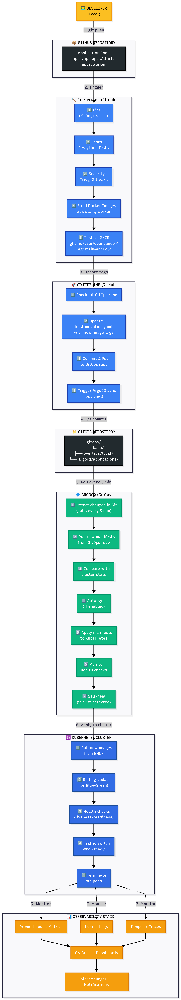
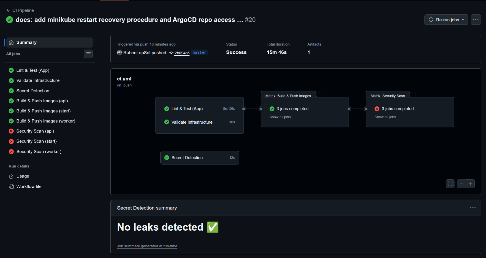
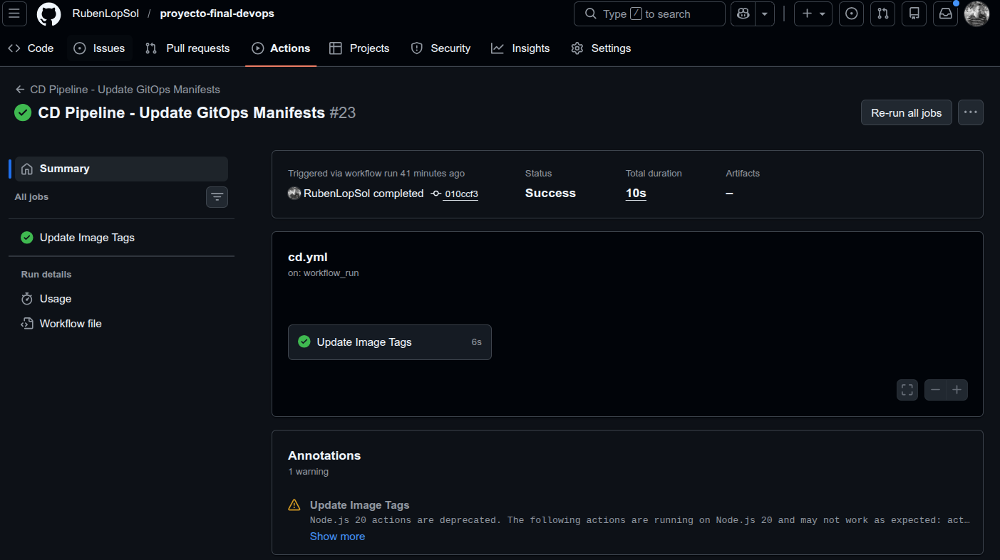

# CI/CD — Pipeline de Integración y Despliegue Continuo

**Proyecto Final — Master DevOps & Cloud Computing**

---

## Visión General

El pipeline CI/CD está implementado con **GitHub Actions** y sigue este flujo:

```
Developer push ──► GitHub Actions CI ──► GHCR (imágenes) ──► CD actualiza manifiestos ──► ArgoCD despliega
```



---



---

## Pipeline CI — `ci.yml`

El pipeline CI se ejecuta en cada `push` a `master`/`main` y en cada Pull Request.

### Jobs del pipeline

```
CI Pipeline
├── lint-and-test          ← Paralelo
├── validate-infra         ← Paralelo
├── secret-scan            ← Paralelo
└── build-and-push         ← Depende de lint-and-test + validate-infra
    └── security-scan      ← Depende de build-and-push
```

---

### Job: Lint & Test (App)

**Directorio de trabajo:** `./openpanel`

| Paso | Acción |
|---|---|
| Setup Node.js 22 | Runtime de la aplicación |
| Install pnpm v9 | Gestor de paquetes |
| `pnpm install` | Instalar dependencias |
| `pnpm lint` | ESLint + Prettier |
| `pnpm type-check` | TypeScript type checking |
| `pnpm test` | Tests unitarios |

---

### Job: Validate Infrastructure

| Paso | Herramienta | Qué valida |
|---|---|---|
| `kustomize build k8s/overlays/local` | Kustomize | Los overlays generan YAML válido |
| `kubeconform` | kubeconform | Los manifiestos cumplen los schemas de Kubernetes 1.28 |
| `kube-linter lint` | kube-linter | Best practices (resources, probes, non-root) |
| `hadolint` | hadolint | Lint de Dockerfiles (API, Start, Worker) |
| `kubectl apply --dry-run=client` | kubectl | Simulación de apply sin tocar el clúster |

---

### Job: Secret Detection

Ejecutado con **Gitleaks** sobre todo el historial del repositorio (`fetch-depth: 0`).

- Detecta tokens, contraseñas y keys en texto plano
- Bloquea el pipeline si encuentra secrets expuestos

---

### Job: Build & Push Images

**Solo se ejecuta en push a `main`/`master`** (no en PRs).

Construye y publica 3 imágenes en paralelo mediante `strategy.matrix`:

| Servicio | Imagen publicada en GHCR |
|---|---|
| `api` | `ghcr.io/rubenlopsol/openpanel-api` |
| `start` | `ghcr.io/rubenlopsol/openpanel-start` |
| `worker` | `ghcr.io/rubenlopsol/openpanel-worker` |

### Estrategia de tags

| Trigger | Tag generado |
|---|---|
| Push a main | `main-<sha7>` (ej: `main-dfc2ddf`) |
| Push a main | `latest` |
| Tag semver | `v1.2.3` |
| Pull Request | `pr-<número>` |

### Cache de Docker

Se utiliza GitHub Actions Cache (`type=gha`) para acelerar las builds:

```yaml
cache-from: type=gha
cache-to: type=gha,mode=max
```

---

### Job: Security Scan

**Trivy** escanea las 3 imágenes publicadas en busca de vulnerabilidades `CRITICAL` y `HIGH`.

- Los resultados se suben como SARIF a GitHub Security Tab
- `continue-on-error: true` — no bloquea el pipeline, pero informa

---

## Pipeline CD — `cd.yml`



El pipeline CD se ejecuta automáticamente **cuando el CI termina con éxito**.

### Trigger

```yaml
on:
  workflow_run:
    workflows: ["CI Pipeline"]
    types: [completed]
    branches: [master, main]
```

### Job: Update Image Tags

Este job actualiza los manifiestos de Kubernetes directamente en Git:

```bash
# Actualiza el tag de imagen en los 3 deployments
sed -i "s|image: ghcr.io/.*/openpanel-api:.*|image: ghcr.io/<owner>/openpanel-api:main-<sha>|g" \
  k8s/base/openpanel/api-deployment-blue.yaml

sed -i "s|image: ghcr.io/.*/openpanel-start:.*|image: ghcr.io/<owner>/openpanel-start:main-<sha>|g" \
  k8s/base/openpanel/start-deployment.yaml

sed -i "s|image: ghcr.io/.*/openpanel-worker:.*|image: ghcr.io/<owner>/openpanel-worker:main-<sha>|g" \
  k8s/base/openpanel/worker-deployment.yaml
```

Luego hace commit y push:

```bash
git config user.name "github-actions[bot]"
git commit -m "chore: update image tags to main-<sha>"
git push
```

ArgoCD detecta este nuevo commit y despliega la nueva versión automáticamente.

---

## Estrategia de Versionado

El proyecto sigue **Semantic Versioning (SemVer)** para releases oficiales.

| Tipo de cambio | Tag de versión | Ejemplo |
|---|---|---|
| Release de producción | `vMAJOR.MINOR.PATCH` | `v1.2.0` |
| Build de desarrollo | `main-<sha7>` | `main-dfc2ddf` |
| Pull Request | `pr-<num>` | `pr-42` |

---

## Secrets del Pipeline

| Secret | Uso |
|---|---|
| `GITHUB_TOKEN` | Login en GHCR para push de imágenes (automático) |
| `GITHUB_TOKEN` | Gitleaks para escaneo de secrets |

No se necesitan secrets adicionales gracias al uso del token automático de GitHub Actions.

---

## Verificar el Estado del Pipeline

```bash
# Ver los últimos workflow runs
gh run list --limit 10

# Ver detalle de un run específico
gh run view <run-id>

# Ver los jobs de un run
gh run view <run-id> --log

# Verificar que la imagen se publicó en GHCR
gh api /users/rubenlopsol/packages/container/openpanel-api/versions \
  --jq '.[0].metadata.container.tags'
```
