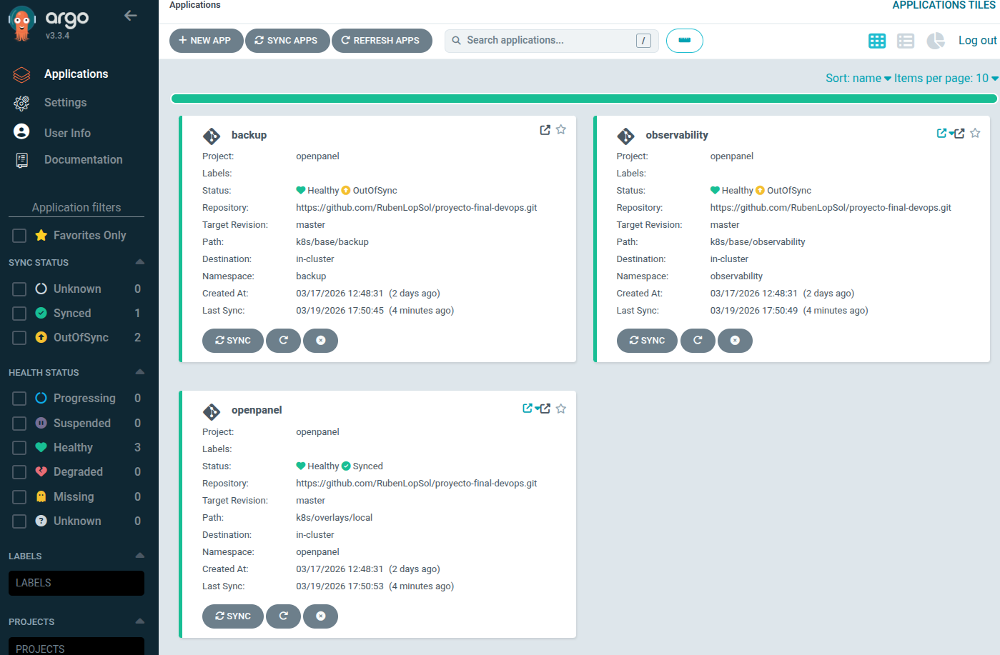
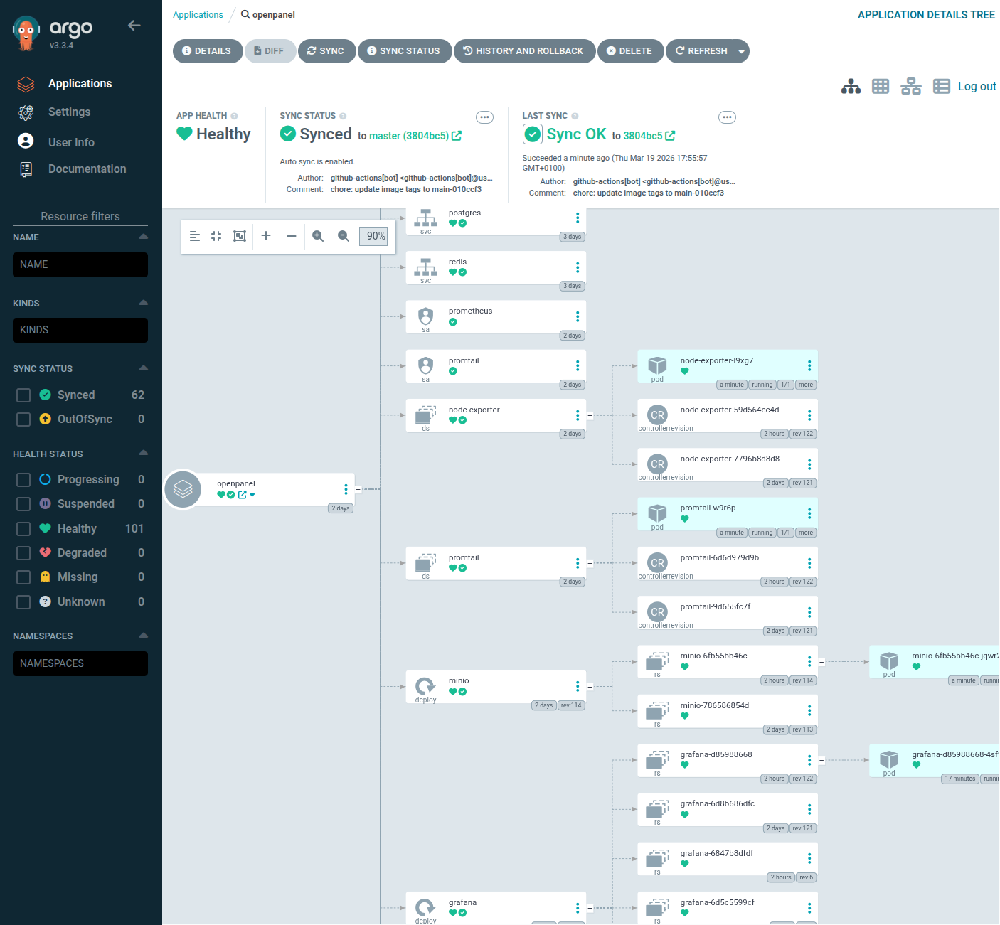
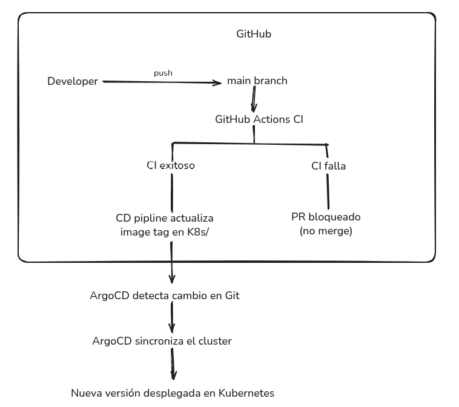

# GitOps — Deployment Flow with ArgoCD

**Final Project — Master in DevOps & Cloud Computing**

---

## GitOps Principles

In this project, Git acts as the **single source of truth** for the cluster state. This means:

- All infrastructure and application configuration is versioned in Git
- No change is applied directly to the cluster without going through Git
- ArgoCD monitors the repository and synchronizes the cluster automatically
- The desired state (Git) always converges toward the real state (cluster)

---

## Repository

```
https://github.com/RubenLopSol/proyecto-final-devops.git
Main branch: master
```

> **Requirement:** The repository must be **public** so that ArgoCD can read the manifests without additional credentials. If the repository is private, credentials must be registered in ArgoCD:
> ```bash
> kubectl create secret generic argocd-repo-creds \
>   -n argocd \
>   --from-literal=url=https://github.com/RubenLopSol \
>   --from-literal=username=RubenLopSol \
>   --from-literal=password=<GITHUB_PAT> \
>   --dry-run=client -o yaml | \
>   kubectl label --local -f - argocd.argoproj.io/secret-type=repo-creds -o yaml | \
>   kubectl apply -f -
> ```

### Manifest structure

```
k8s/
├── apps/                        ← Application layer (workloads)
│   ├── base/
│   │   └── openpanel/           ← Base manifests: API, Worker, DBs, Ingress
│   └── overlays/
│       ├── staging/             ← Minikube: 1 replica, reduced resources
│       └── prod/                ← Production: higher replicas, TLS, PDB
└── infrastructure/              ← Platform layer (cluster tooling)
    ├── base/
    │   ├── namespaces/          ← Namespace definitions
    │   ├── observability/       ← Base Helm values: Prometheus, Grafana, Loki, Tempo
    │   ├── backup/              ← MinIO + Velero daily schedule
    │   └── sealed-secrets/      ← Secrets encrypted with Sealed Secrets
    ├── overlays/
    │   ├── staging/             ← Minikube: 5Gi PVC, 3d retention
    │   └── prod/                ← Production: 50Gi PVC, 30d retention, hourly backup
    └── argocd/
        ├── bootstrap-app.yaml   ← App of Apps root
        ├── applications/        ← ArgoCD Application CRDs
        └── projects/            ← ArgoCD Project CRD
```

---

## ArgoCD — Project

The `openpanel` project in ArgoCD groups the three applications and defines permissions:

```yaml
# k8s/infrastructure/argocd/projects/openpanel-project.yaml
apiVersion: argoproj.io/v1alpha1
kind: AppProject
metadata:
  name: openpanel
  namespace: argocd
```

---

## App of Apps — Bootstrap

Instead of manually running `kubectl apply -f k8s/infrastructure/argocd/applications/` every time an application is added, the project uses the **App of Apps** pattern:

`k8s/infrastructure/argocd/bootstrap-app.yaml` is an ArgoCD Application that watches the `k8s/infrastructure/argocd/applications/` directory on the master branch. When any Application is added or modified in that directory, the bootstrap detects it and applies it automatically.

**To bootstrap the entire system:**

```bash
# One single command after installing ArgoCD
kubectl apply -f k8s/infrastructure/argocd/bootstrap-app.yaml

# From here ArgoCD manages everything else automatically
```

**Benefits:**
- Adding a new application = create a YAML in `k8s/infrastructure/argocd/applications/` + push
- The CD pipeline can update the `targetRevision` of Applications in Git — ArgoCD applies the change without manual intervention
- Auditable: every change to Applications is in the Git history

---



---

## ArgoCD — Applications



**12 ArgoCD applications** are managed, organised in layers:

| Application | Source (Git path) | Target namespace | Wave |
|---|---|---|---|
| `bootstrap` | `k8s/infrastructure/overlays/staging/argocd` | `argocd` | — |
| `namespaces` | `k8s/infrastructure/base/namespaces` | `kube-system` | 0 |
| `sealed-secrets` | `k8s/infrastructure/overlays/staging/sealed-secrets` | `sealed-secrets` | 1 |
| `local-path-provisioner` | `k8s/infrastructure/base/local-path-provisioner` | `local-path-storage` | 1 |
| `prometheus` | `k8s/infrastructure/overlays/staging/observability/kube-prometheus-stack` | `observability` | 2 |
| `minio` | `k8s/infrastructure/overlays/staging/minio` | `backup` | 2 |
| `velero-operator` | `k8s/infrastructure/overlays/staging/velero-operator` | `velero` | 2 |
| `loki` | `k8s/infrastructure/overlays/staging/observability/loki` | `observability` | 3 |
| `promtail` | `k8s/infrastructure/overlays/staging/observability/promtail` | `observability` | 3 |
| `tempo` | `k8s/infrastructure/overlays/staging/observability/tempo` | `observability` | 3 |
| `velero` | `k8s/infrastructure/overlays/staging/velero` | `velero` | 3 |
| `openpanel` | `k8s/apps/overlays/staging` | `openpanel` | 4 |

The observability stack is **split into 4 independent apps** instead of a single aggregator. Each manages one Helm chart, using `kustomize build --enable-helm` with base + overlay values files.

The `sealed-secrets` app also uses `--enable-helm` to render the controller chart, and includes the `secrets.yaml` file with encrypted SealedSecrets.

### Deployment order — Sync Waves

| Wave | Apps | Reason |
|---|---|---|
| 0 | `namespaces` | All namespaces must exist before any app deploys into them |
| 1 | `sealed-secrets`, `local-path-provisioner` | Secrets controller and StorageClass ready before any workload |
| 2 | `prometheus`, `minio`, `velero-operator` | `prometheus` installs Prometheus Operator CRDs (ServiceMonitor, PrometheusRule); required by wave 3 |
| 3 | `loki`, `promtail`, `tempo`, `velero` | Depend on CRDs from wave 2; full observability stack ready before the application |
| 4 | `openpanel` | App lands on a cluster with full observability, secrets, and backup already operational |

OpenPanel pods start with Prometheus already scraping via ServiceMonitors, Promtail already collecting logs, and Grafana already running — no gaps in metrics or log history from day one.

### Automatic sync configuration

```yaml
syncPolicy:
  automated:
    prune: true        # Removes resources that are no longer in Git
    selfHeal: true     # Corrects deviations from the desired state
    allowEmpty: false  # Does not allow deleting all resources
  syncOptions:
    - CreateNamespace=true
    - PrunePropagationPolicy=foreground
    - PruneLast=true
  retry:
    limit: 5
    backoff:
      duration: 5s
      factor: 2
      maxDuration: 3m
```

**`selfHeal: true`** — If someone modifies a resource directly in the cluster (`kubectl edit`), ArgoCD will revert it in the next sync cycle (every ~3 minutes).

**`prune: true`** — If a resource is removed from the Git repository, ArgoCD will also remove it from the cluster.

---

## GitOps Deployment Flow


---

## Kustomize — Overlays (staging and prod)

The project maintains two overlays following the standard Kustomize convention:

**`k8s/apps/overlays/staging`** — deployed on Minikube by ArgoCD. Reduces replicas and resources so the local cluster does not run out of memory:

```yaml
# k8s/apps/overlays/staging/kustomization.yaml
apiVersion: kustomize.config.k8s.io/v1beta1
kind: Kustomization

resources:
  - ../../base/namespaces
  - ../../base/openpanel

commonAnnotations:
  environment: staging
  managed-by: kustomize

patches:
  - path: patches/api-blue.yaml   # replicas: 1, cpu: 100m, mem: 256Mi
  - path: patches/start.yaml      # cpu: 100m, mem: 128Mi
  - path: patches/worker.yaml     # cpu: 100m, mem: 256Mi
```

**`k8s/apps/overlays/prod`** — configuration for a real production cluster. Scales replicas, adds TLS via cert-manager, and a PodDisruptionBudget:

```yaml
# k8s/apps/overlays/prod/kustomization.yaml
apiVersion: kustomize.config.k8s.io/v1beta1
kind: Kustomization

resources:
  - ../../base/namespaces
  - ../../base/openpanel
  - resources/pdb.yaml            # PodDisruptionBudget (prod only)

commonAnnotations:
  environment: prod
  managed-by: kustomize

patches:
  - path: patches/api-blue.yaml   # replicas: 3
  - path: patches/worker.yaml     # replicas: 2
  - path: patches/ingress.yaml    # TLS + real domains
  - path: patches/configmap.yaml  # production URLs
```

CI validates **both** overlays on every PR — a broken prod patch is caught before it reaches any cluster.

---

## Useful ArgoCD Commands

> **Prerequisite:** the ArgoCD CLI requires a prior login against the server. Run once per session:
> ```bash
> kubectl port-forward svc/argocd-server -n argocd 8080:80 &
> argocd login localhost:8080 --insecure \
>   --username admin \
>   --password $(kubectl -n argocd get secret argocd-initial-admin-secret \
>     -o jsonpath="{.data.password}" | base64 -d)
> ```

```bash
# View status of all apps
argocd app list

# Manually sync an app
argocd app sync openpanel

# View deployment history
argocd app history openpanel

# Roll back to a previous version
argocd app rollback openpanel <revision-id>

# View the history of release tags (deployments)
git tag --list 'release/*' --sort=-version:refname | head -10

# Roll back to a previous release tag via GitOps:
# 1. Edit k8s/infrastructure/argocd/applications/openpanel-app.yaml
# 2. Change targetRevision to the desired tag
# 3. git add + commit + push → ArgoCD applies the change

# View differences between Git and the cluster
argocd app diff openpanel

# Force synchronization (even without changes)
argocd app sync openpanel --force
```

---

## Secret Management with Sealed Secrets

Secrets cannot be stored in plain text in Git. Sealed Secrets encrypts them with the cluster's RSA public key. Only the cluster controller can decrypt them.

### How they are generated

All project secrets are managed in a single file per environment:

```
k8s/infrastructure/overlays/staging/sealed-secrets/secrets.yaml
k8s/infrastructure/overlays/prod/sealed-secrets/secrets.yaml
```

To regenerate the file (e.g. after recreating the cluster or rotating credentials):

```bash
# Staging with defaults from .secrets
make reseal-secrets ENV=staging

# Prod with strong credentials
make reseal-secrets ENV=prod \
  POSTGRES_PASSWORD=xxx REDIS_PASSWORD=xxx CLICKHOUSE_PASSWORD=xxx \
  API_SECRET=$(openssl rand -hex 32) GRAFANA_PASSWORD=xxx MINIO_PASSWORD=xxx
```

`make reseal-secrets` fetches the controller certificate, creates each Secret in-memory with `kubectl create --dry-run`, encrypts it with `kubeseal`, and writes all of them into the file. The result is safe to commit — the values are RSA-encrypted blobs.

### Managed secrets

| Secret | Target namespace | Contents |
|---|---|---|
| `postgres-credentials` | `openpanel` | PostgreSQL username and password |
| `redis-credentials` | `openpanel` | Redis password |
| `clickhouse-credentials` | `openpanel` | ClickHouse username and password |
| `openpanel-secrets` | `openpanel` | DATABASE_URL, CLICKHOUSE_URL, REDIS_URL, API_SECRET |
| `grafana-admin-credentials` | `observability` | Grafana admin username and password |
| `minio-credentials` | `backup` | MINIO_ROOT_USER, MINIO_ROOT_PASSWORD |

---

## Verifying GitOps Status

```bash
# Status of applications in ArgoCD
kubectl get applications -n argocd

# View sync events
kubectl describe application openpanel -n argocd

# Verify that ArgoCD is in sync
kubectl get application openpanel -n argocd \
  -o jsonpath='{.status.sync.status}'
# Should return: Synced
```
