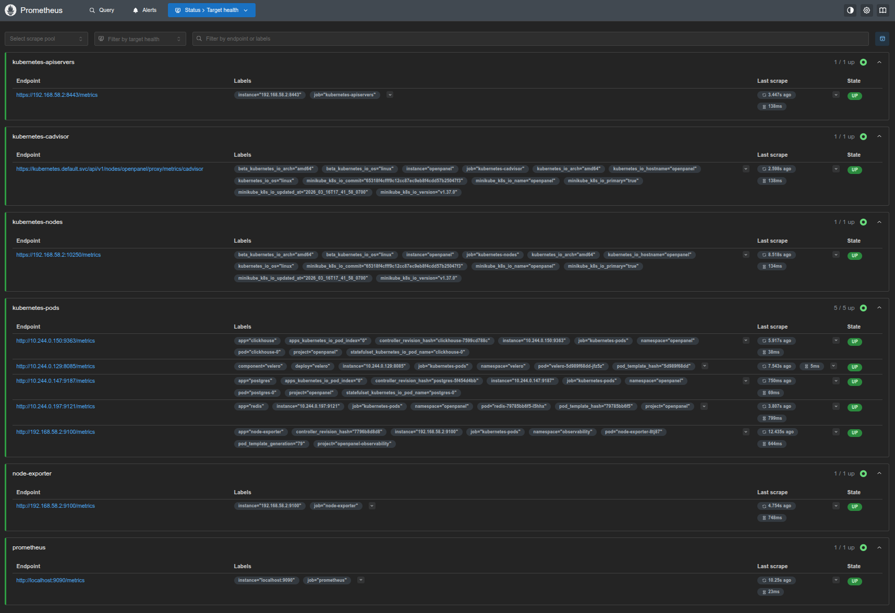
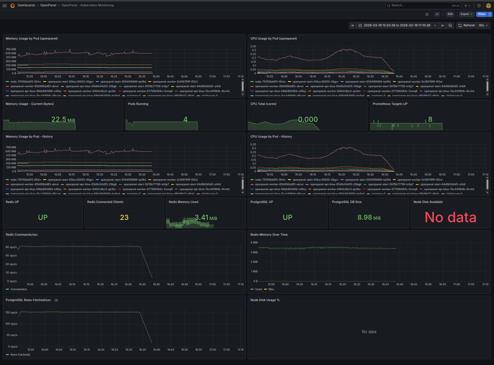
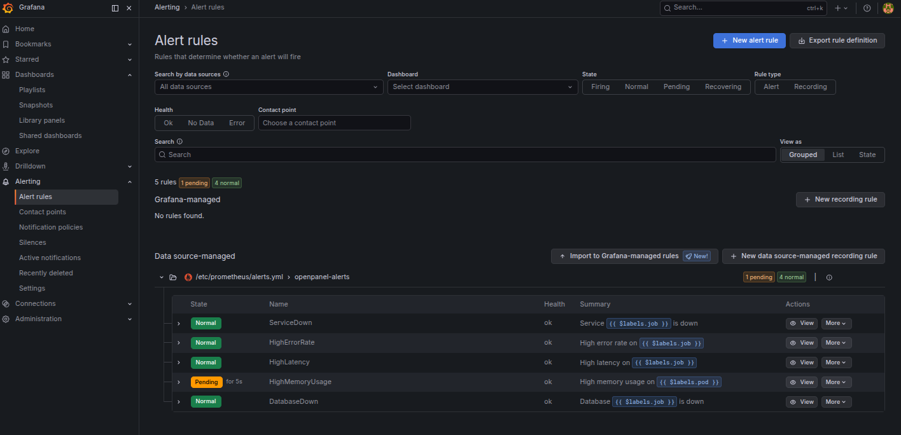

# Observabilidad — Métricas, Logs y Trazas

**Proyecto Final — Master DevOps & Cloud Computing**

---

## Stack de Observabilidad

El sistema implementa los tres pilares de la observabilidad:

| Pilar | Herramienta | Puerto | Descripción |
|---|---|---|---|
| **Métricas** | Prometheus | 9090 | Recopila métricas de series temporales |
| **Logs** | Loki + Promtail | 3100 | Agrega logs de todos los pods |
| **Trazas** | Tempo | 3200 / 4317 | Tracing distribuido (OTLP) |
| **Dashboards** | Grafana | 3000 | Visualización unificada |

Todos los componentes se despliegan en el namespace `observability` mediante **Helm charts oficiales** gestionados por ArgoCD.

---

## Prometheus

### Configuración

Prometheus scrape los siguientes targets:

| Target | Puerto | Qué mide |
|---|---|---|
| `cadvisor` | 8080 | Métricas de contenedores (CPU, memoria, red) |
| `node-exporter` | 9100 | Métricas del nodo (CPU, memoria, disco) |
| `redis_exporter` | 9121 | Métricas de Redis (comandos/s, memoria, clientes) |
| `postgres_exporter` | 9187 | Métricas de PostgreSQL (conexiones, queries, tamaño) |
| ClickHouse | 9363 | Métricas nativas de ClickHouse (queries, rows, memoria) |
| Kubernetes pods | — | Autodescubrimiento vía annotations |

### Arquitectura de Exporters

```
redis-deployment
├── container: redis         (puerto 6379)
└── container: redis_exporter (puerto 9121, sidecar)

postgres-statefulset
├── container: postgres        (puerto 5432)
└── container: postgres_exporter (puerto 9187, sidecar)

clickhouse-statefulset
└── container: clickhouse     (puerto 9363, métricas nativas via XML config)

node-exporter-daemonset       (puerto 9100, un pod por nodo)
```

### Verificar targets activos

```bash
# Port-forward a Prometheus
kubectl port-forward svc/prometheus -n observability 9090:9090

# Acceder a http://localhost:9090/targets
# Todos los targets deben estar en estado "UP"
```



---

## Grafana

### Dashboard: OpenPanel K8s Monitoring

El dashboard `openpanel-k8s` (uid: `openpanel-k8s`) contiene **18 paneles** organizados en filas:

#### Fila: Kubernetes Resources

| Panel | Tipo | Métrica |
|---|---|---|
| Memory Usage by Pod | Timeseries | `container_memory_working_set_bytes` |
| CPU Usage by Pod | Timeseries | `rate(container_cpu_usage_seconds_total[5m])` |
| Top 5 Pods by Memory | Stat | `topk(5, ...)` |
| Top 5 Pods by CPU | Stat | `topk(5, ...)` |

#### Fila: Redis

| Panel | Tipo | Métrica |
|---|---|---|
| Redis UP | Stat | `redis_up` |
| Redis Connected Clients | Stat | `redis_connected_clients` |
| Redis Used Memory | Stat | `redis_memory_used_bytes` |
| Redis Commands/sec | Timeseries | `rate(redis_commands_processed_total[5m])` |
| Redis Memory Over Time | Timeseries | `redis_memory_used_bytes` |

#### Fila: PostgreSQL

| Panel | Tipo | Métrica |
|---|---|---|
| PostgreSQL UP | Stat | `pg_up` |
| PostgreSQL DB Size | Stat | `pg_database_size_bytes` |
| PostgreSQL Rows Fetched/sec | Timeseries | `rate(pg_stat_database_tup_fetched[5m])` |

#### Fila: Node

| Panel | Tipo | Métrica |
|---|---|---|
| Node Disk Available | Stat | `node_filesystem_avail_bytes` |
| Node Disk Usage % | Timeseries | Disk free/total ratio |



---

### Automatización del Dashboard

Grafana se despliega vía el chart `kube-prometheus-stack`. Los datasources (Prometheus, Loki, Tempo) se configuran automáticamente mediante el campo `additionalDataSources` en `k8s/helm/values/kube-prometheus-stack.yaml`.

No se requiere ninguna acción manual — al arrancar Grafana, los datasources aparecen automáticamente configurados.

---

### Acceder a Grafana

```bash
# Via Ingress (requiere /etc/hosts configurado)
# http://grafana.local

# Via port-forward
kubectl port-forward svc/observability-prometheus-grafana -n observability 3000:3000
# http://localhost:3000
# Usuario: admin / Password: admin (configurable en kube-prometheus-stack.yaml)
```

### Datasources configurados

| Datasource | URL interna | Tipo |
|---|---|---|
| Prometheus | `http://observability-prometheus-prometheus.observability.svc.cluster.local:9090` | prometheus |
| Loki | `http://loki-gateway.observability.svc.cluster.local` | loki |
| Tempo | `http://tempo.observability.svc.cluster.local:3100` | tempo |

---

## Loki + Promtail

**Promtail** es un DaemonSet que se ejecuta en cada nodo, recopila los logs de todos los pods y los envía a **Loki**.

### Consultar logs en Grafana (LogQL)

```logql
# Logs de la API
{namespace="openpanel", app="openpanel-api"}

# Logs de error en todos los pods
{namespace="openpanel"} |= "error"

# Logs del worker con filtro por nivel
{namespace="openpanel", app="openpanel-worker"} | json | level="error"

# Logs de los últimos 15 minutos de Postgres
{namespace="openpanel", app="postgres"} [15m]
```

---

## Tempo — Tracing Distribuido

Tempo recibe trazas en formato **OTLP** (OpenTelemetry Protocol) en el puerto 4317 (gRPC).

Para habilitar tracing en la aplicación, configurar la variable de entorno:

```
OTEL_EXPORTER_OTLP_ENDPOINT=http://tempo.observability.svc.cluster.local:4317
```

Las trazas se pueden explorar desde Grafana usando el datasource Tempo.

---

## Alertas — Prometheus AlertManager

Las alertas siguen este flujo:

```
Prometheus evalúa las reglas cada 30s
       │
       │ condición verdadera durante el tiempo configurado
       ▼
Se dispara la alerta → se envía a AlertManager
       │
       ▼
AlertManager agrupa alertas (por alertname + namespace + severity)
— espera 30s para agrupar alertas relacionadas (group_wait)
— silencia warnings si ya hay un critical para la misma alerta (inhibit_rules)
       │
       ▼
El router envía al receiver configurado
— actualmente: receiver 'null' (no-op, para demo local)
— producción: reemplazar con Slack/email/PagerDuty
```

### Reglas de alerta configuradas

Las reglas están definidas en `k8s/helm/values/kube-prometheus-stack.yaml`:

| Alerta | Condición | Duración | Severidad |
|---|---|---|---|
| `ServiceDown` | `up{job=~".*openpanel.*"} == 0` | 2 min | critical |
| `HighErrorRate` | Tasa de errores HTTP 5xx > 5% | 5 min | critical |
| `HighMemoryUsage` | Uso de memoria > 90% del límite | 5 min | warning |
| `DatabaseDown` | `pg_up == 0 or redis_up == 0` | 1 min | critical |

### AlertManager — Routing y receivers

AlertManager está habilitado con la siguiente configuración:

- **group_by**: `alertname`, `namespace`, `severity` — agrupa alertas relacionadas
- **inhibit_rules**: si dispara un `critical` para una alerta, silencia el `warning` del mismo alertname en el mismo namespace
- **Receiver actual**: `null` (demo local — las alertas se evalúan y enrutan pero no se reenvían)

Para añadir notificaciones reales, reemplazar el receiver en `k8s/helm/values/kube-prometheus-stack.yaml`:

```yaml
receivers:
  - name: 'slack'
    slack_configs:
      - api_url: 'https://hooks.slack.com/services/...'
        channel: '#alerts'
        send_resolved: true
```

### Verificar AlertManager

```bash
kubectl port-forward svc/alertmanager-operated -n observability 9093:9093
# http://localhost:9093
```



---

## Despliegue — Helm charts via ArgoCD

El stack de observabilidad se gestiona con **4 Helm charts oficiales**, cada uno con su propia ArgoCD Application:

| ArgoCD Application | Helm Chart | Versión | Incluye |
|---|---|---|---|
| `observability-prometheus` | `prometheus-community/kube-prometheus-stack` | 65.1.1 | Prometheus + Grafana + Node Exporter + kube-state-metrics |
| `observability-loki` | `grafana/loki` | 6.6.2 | Loki (modo single binary) |
| `observability-promtail` | `grafana/promtail` | 6.16.4 | Promtail DaemonSet |
| `observability-tempo` | `grafana/tempo` | 1.10.3 | Tempo |

Los values de cada chart se gestionan en `k8s/helm/values/` y se versionan en Git. ArgoCD usa la feature **multi-source** para combinar el chart de Helm con los values del repositorio.

---

## Verificación del Stack

```bash
# Verificar todos los pods de observabilidad
kubectl get pods -n observability

# Verificar que ArgoCD sincronizó las 4 apps
kubectl get applications -n argocd | grep observability

# Ver targets de Prometheus (todos deben ser UP)
kubectl port-forward svc/observability-prometheus-prometheus -n observability 9090:9090
# http://localhost:9090/targets

# Ver logs de Promtail (verificar que recopila logs)
kubectl logs -n observability -l app.kubernetes.io/name=promtail --tail=20

# Si un pod está en CrashLoopBackOff
kubectl describe pod -n observability <pod-name>
```
