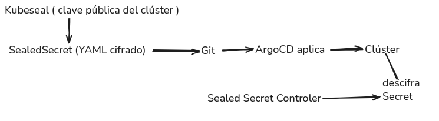
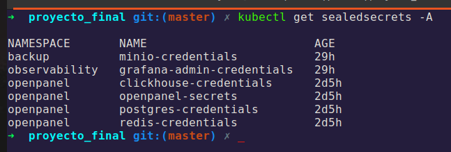
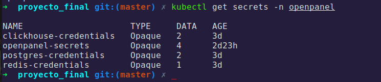
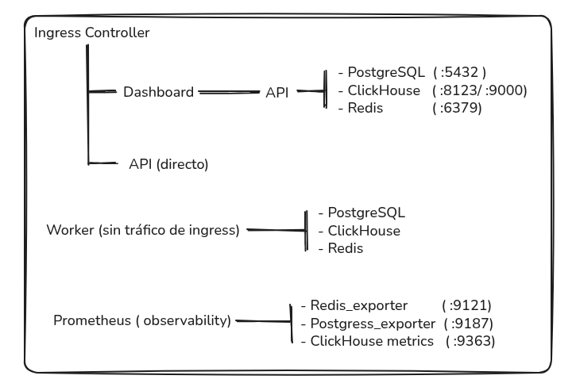

# Seguridad — Secrets, Network Policies, RBAC y Hardening

**Proyecto Final — Master DevOps & Cloud Computing**

---

## Visión General

La seguridad se aplica en múltiples capas:

| Capa | Mecanismo | Herramienta |
|---|---|---|
| Secrets en Git | Cifrado con clave del clúster | Sealed Secrets |
| Secrets en pipeline CI | Variables cifradas del repositorio | GitHub Secrets |
| Tráfico de red | Reglas de allow/deny por pod | Network Policies |
| Permisos de pods | No-root, read-only filesystem | SecurityContext |
| Permisos de ArgoCD | Mínimos por componente | RBAC + ServiceAccount |
| Imágenes de contenedor | Escaneo de vulnerabilidades | Trivy (en CI) |

---

## Sealed Secrets — Secrets en Git

En GitOps, todo debe estar en Git — incluyendo los secrets. **Sealed Secrets** permite commitear secrets cifrados de forma segura.

### Cómo funciona



Solo el controlador del clúster (que tiene la clave privada) puede descifrar el SealedSecret. Aunque alguien acceda al repositorio, los valores están cifrados.

### Secrets gestionados

| Archivo | Namespace | Contenido |
|---|---|---|
| `postgres-credentials.yaml` | openpanel | Usuario y contraseña de PostgreSQL |
| `redis-credentials.yaml` | openpanel | Contraseña de Redis |
| `clickhouse-credentials.yaml` | openpanel | Usuario y contraseña de ClickHouse |
| `openpanel-secrets.yaml` | openpanel | Variables sensibles de la aplicación |



### Crear un nuevo Sealed Secret

```bash
# 1. Crear el secret en local (sin aplicar al clúster)
kubectl create secret generic nuevo-secret \
  --from-literal=clave=valor \
  --namespace openpanel \
  --dry-run=client -o yaml > /tmp/secret.yaml

# 2. Cifrar con kubeseal
kubeseal \
  --controller-namespace sealed-secrets \
  --format yaml \
  < /tmp/secret.yaml \
  > k8s/argocd/sealed-secrets/nuevo-secret.yaml

# 3. Limpiar el archivo temporal
rm /tmp/secret.yaml

# 4. Commitear el SealedSecret (seguro de hacer)
git add k8s/argocd/sealed-secrets/nuevo-secret.yaml
git commit -m "feat: add sealed secret for nuevo-secret"
git push
```

### Verificar que el Secret se descifra

```bash
# El controlador crea el Secret automáticamente
kubectl get secret nuevo-secret -n openpanel

# Ver el valor descifrado (solo si tienes permisos en el clúster)
kubectl get secret nuevo-secret -n openpanel \
  -o jsonpath='{.data.clave}' | base64 -d
```



---

## Network Policies — Segmentación de Red

Se aplica un modelo **deny-by-default**: todo el tráfico está bloqueado por defecto, y solo se permiten las conexiones explícitamente necesarias.

### Políticas aplicadas en el namespace `openpanel`

| Policy | Tipo | Descripción |
|---|---|---|
| `default-deny-all` | Ingress + Egress | Bloquea todo el tráfico por defecto |
| `allow-dns` | Egress | Permite resolución DNS (UDP/TCP 53) para todos los pods |
| `allow-api-ingress` | Ingress | API acepta tráfico solo del Ingress Controller y del Dashboard |
| `allow-api-egress` | Egress | API puede conectar a PostgreSQL (5432), ClickHouse (8123/9000), Redis (6379) |
| `allow-worker-egress` | Egress | Worker puede conectar a PostgreSQL, ClickHouse y Redis |
| `allow-start-ingress` | Ingress | Dashboard acepta tráfico solo del Ingress Controller |
| `allow-start-egress` | Egress | Dashboard puede conectar solo a la API (3000) |
| `allow-db-ingress` | Ingress | Bases de datos aceptan conexiones solo de API y Worker |
| `allow-prometheus-scraping` | Ingress | Exporters (9121, 9187, 9363) aceptan scraping desde namespace `observability` |

### Diagrama de conectividad permitida




---

## SecurityContext — Contenedores Non-Root

Todos los pods están configurados para ejecutarse como usuario no-root:

```yaml
# Ejemplo en el deployment de la API
spec:
  securityContext:
    runAsNonRoot: true
    runAsUser: 1001
    fsGroup: 1001
  containers:
    - name: api
      securityContext:
        allowPrivilegeEscalation: false
        readOnlyRootFilesystem: true
```

El mismo patrón se aplica en Grafana (usuario 472), Prometheus y los demás componentes del stack de observabilidad.

---

## RBAC — Permisos Mínimos

Cada componente tiene su propio **ServiceAccount** con solo los permisos necesarios.

### Prometheus

Prometheus necesita permisos de lectura sobre los recursos del clúster para el autodescubrimiento de targets (nodos, pods, servicios, endpoints e ingresses).

El RBAC de Prometheus (ClusterRole + ClusterRoleBinding + ServiceAccount) es gestionado automáticamente por el chart **`kube-prometheus-stack`** al desplegarse vía ArgoCD. No es necesario mantener YAMLs manuales de RBAC.

```yaml
# Permisos que aplica el chart internamente:
rules:
  - apiGroups: [""]
    resources: ["nodes", "pods", "services", "endpoints"]
    verbs: ["get", "list", "watch"]
  - apiGroups: ["extensions", "networking.k8s.io"]
    resources: ["ingresses"]
    verbs: ["get", "list", "watch"]
```

### Promtail

Promtail necesita permisos para listar pods y leer sus logs. Al igual que Prometheus, el RBAC es gestionado automáticamente por el chart **`grafana/promtail`**:

```yaml
# Permisos que aplica el chart internamente:
rules:
  - apiGroups: [""]
    resources: ["pods", "nodes"]
    verbs: ["get", "list", "watch"]
```

### ArgoCD

ArgoCD tiene su propio sistema de RBAC. El proyecto `openpanel` limita las aplicaciones a los namespaces `openpanel`, `observability` y `backup`.

---

## Escaneo de Imágenes con Trivy

**Trivy** se ejecuta en el pipeline CI después de cada build de imagen.

```yaml
# .github/workflows/ci.yml — job security-scan
- name: Run Trivy vulnerability scanner
  uses: aquasecurity/trivy-action@master
  with:
    image-ref: "ghcr.io/rubenlopsol/openpanel-api:latest"
    format: "sarif"
    severity: "CRITICAL,HIGH"
    exit-code: "0"    # No bloquea, solo informa
```

Los resultados se suben automáticamente a la pestaña **Security** del repositorio GitHub (formato SARIF).

---

## GitHub Secrets — Secrets del Pipeline CI

Los tokens necesarios en el pipeline se gestionan como GitHub Secrets (cifrados en GitHub):

| Secret | Uso |
|---|---|
| `GITHUB_TOKEN` | Login en GHCR para push de imágenes (automático, no requiere configuración) |

No hay secrets adicionales que configurar manualmente — GitHub proporciona `GITHUB_TOKEN` automáticamente en cada workflow run.

---

## Verificar el Estado de Seguridad

```bash
# Verificar que ningún pod corre como root
kubectl get pods -n openpanel -o jsonpath=\
  '{range .items[*]}{.metadata.name}{"\t"}{.spec.securityContext.runAsUser}{"\n"}{end}'

# Verificar Network Policies activas
kubectl get networkpolicies -n openpanel

# Verificar Sealed Secrets descifrados
kubectl get secrets -n openpanel

# Ver eventos del Sealed Secrets controller
kubectl logs -n sealed-secrets \
  deployment/sealed-secrets -l app.kubernetes.io/name=sealed-secrets
```
