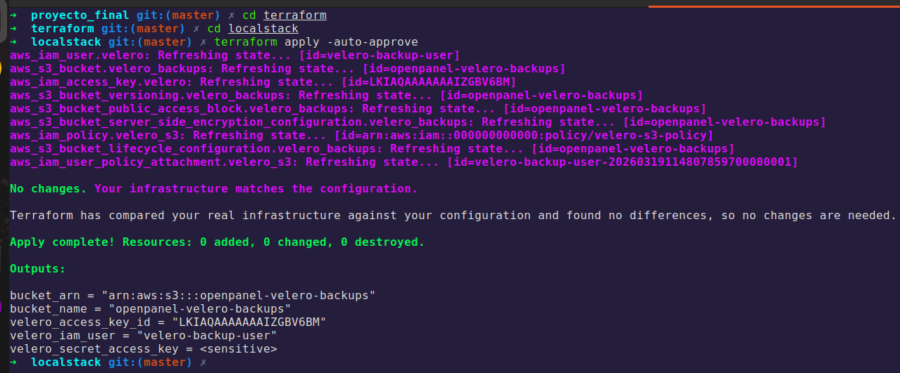

# Terraform — Backup Infrastructure on AWS

**Final Project — Master in DevOps & Cloud Computing**

---

## Purpose

Terraform provisions the external storage infrastructure the cluster depends on for two things:

- **S3 Bucket** — where Velero writes daily Kubernetes backups. Configured with versioning, AES-256 encryption, public access block, and automatic lifecycle.
- **Secrets Manager slot** — stores the Sealed Secrets controller RSA key. If the cluster is destroyed and recreated, this key allows existing SealedSecrets to be decrypted without re-sealing everything.

Terraform creates the empty slots. The actual content is written later by Makefile targets: `make backup-sealing-key` and Velero respectively.

---

## Structure

```
terraform/
├── modules/                        ← Reusable logic (no environment-specific values)
│   ├── backup-storage/             ← S3 bucket + Secrets Manager slot
│   │   ├── versions.tf             # Provider requirements
│   │   ├── main.tf                 # Resources
│   │   ├── variables.tf            # Inputs
│   │   └── outputs.tf              # Outputs: bucket ARN, secret ARN
│   ├── iam-irsa/                   ← IAM Role + OIDC trust policy (real EKS)
│   │   ├── versions.tf
│   │   ├── main.tf
│   │   ├── variables.tf
│   │   └── outputs.tf              # Outputs: role ARN, velero install command
│   └── iam-user/                   ← IAM User + Access Key (LocalStack only)
│       ├── versions.tf
│       ├── main.tf
│       ├── variables.tf
│       └── outputs.tf              # Outputs: access_key_id, secret_access_key
└── environments/                   ← One directory per environment
    ├── localstack/                 ← Local development (Docker, no real AWS)
    │   ├── versions.tf             # No backend (local state, gitignored)
    │   ├── providers.tf            # Provider pointing to localhost:4566
    │   ├── main.tf                 # Calls backup-storage + iam-user modules
    │   ├── variables.tf
    │   └── outputs.tf
    ├── staging/                    ← Staging on real AWS
    │   ├── versions.tf             # S3 backend: staging/terraform.tfstate
    │   ├── providers.tf            # AWS provider with environment credentials
    │   ├── main.tf                 # Calls backup-storage + iam-irsa modules
    │   ├── variables.tf
    │   ├── outputs.tf
    │   └── terraform.tfvars.example
    └── prod/                       ← Production on real AWS
        ├── versions.tf             # S3 backend: prod/terraform.tfstate
        ├── providers.tf            # AWS provider with environment credentials
        ├── main.tf                 # Calls backup-storage + iam-irsa modules
        ├── variables.tf
        ├── outputs.tf
        └── terraform.tfvars.example
```

This pattern mirrors the Kubernetes overlay structure exactly:

| Kubernetes | Terraform |
|---|---|
| `k8s/apps/base/` | `terraform/modules/` |
| `k8s/apps/overlays/staging/` | `terraform/environments/staging/` |
| `k8s/apps/overlays/prod/` | `terraform/environments/prod/` |

### Why separate `versions.tf`, `providers.tf`, and `main.tf`?

- **`versions.tf`** — declares the `terraform {}` block: minimum version, required provider, and `backend`. It is static and almost never changes.
- **`providers.tf`** — contains only the `provider {}` block. Allows changing provider configuration (region, assume_role for CI) without touching module logic.
- **`main.tf`** — only module calls. Reading it makes clear what the environment creates, with no boilerplate noise.

---

## Environment differences

| | `localstack` | `staging` | `prod` |
|---|---|---|---|
| Target | LocalStack at localhost:4566 | Real AWS | Real AWS |
| Authentication | `test`/`test` (hardcoded) | Environment credentials | Environment credentials |
| IAM | IAM User + Access Key | IRSA (Role + OIDC) | IRSA (Role + OIDC) |
| State | Local (gitignored) | S3 remote (`staging/`) | S3 remote (`prod/`) |
| Backup retention | 30 days | 30 days | 90 days |
| Secret recovery window | 0 days (immediate) | 7 days | 30 days |

---

## Modules

### `backup-storage`

Creates the same two resources in all environments:

- **S3 bucket** with versioning, AES-256, full public access block, and lifecycle rule
- **Secrets Manager secret** (`devops-cluster/sealed-secrets-master-key`) — empty slot populated by `make backup-sealing-key`

### `iam-irsa`

Used in **staging** and **prod**. Creates an IAM Role with a trust policy that only allows the Velero ServiceAccount in the `velero` namespace on the specific EKS cluster to assume it. No static credentials are generated.

### `iam-user`

Used in **localstack** only. Creates an IAM User + Access Key because LocalStack has no real OIDC provider. Credentials are written to `credentials-velero` (gitignored) and passed to `velero install --secret-file`.

---

## Variables per environment

### `localstack` and `staging`

| Variable | `localstack` | `staging` |
|---|---|---|
| `bucket_name` | `openpanel-velero-backups` | `openpanel-velero-backups-staging` |
| `retention_days` | `30` | `30` |
| `eks_cluster_name` | — (not applicable) | `openpanel-staging` |

### `prod`

| Variable | Default value |
|---|---|
| `bucket_name` | `openpanel-velero-backups-prod` |
| `retention_days` | `90` |
| `eks_cluster_name` | `openpanel-prod` |
| `sealed_secrets_secret_name` | `devops-cluster-prod/sealed-secrets-master-key` |

---

## Usage

### LocalStack (local development)

Requires LocalStack running:

```bash
docker run -d -p 4566:4566 localstack/localstack
```

```bash
cd terraform/environments/localstack
terraform init
terraform apply
```

Get credentials for `credentials-velero`:

```bash
terraform output velero_access_key_id
terraform output -raw velero_secret_access_key
```

Verify the created resources:

```bash
# Check the bucket in LocalStack
aws --endpoint-url=http://localhost:4566 s3 ls
aws --endpoint-url=http://localhost:4566 s3api get-bucket-versioning \
  --bucket openpanel-velero-backups

# Check the IAM user
aws --endpoint-url=http://localhost:4566 iam list-users

# Check the Secrets Manager secret
aws --endpoint-url=http://localhost:4566 secretsmanager list-secrets
```



### Staging / Prod (real AWS)

The S3 backend must exist before running `terraform init`. Create it once with the AWS CLI:

```bash
# Create the state bucket
aws s3api create-bucket \
  --bucket openpanel-terraform-state \
  --region us-east-1
aws s3api put-bucket-versioning \
  --bucket openpanel-terraform-state \
  --versioning-configuration Status=Enabled

# Create the DynamoDB table for state locking
aws dynamodb create-table \
  --table-name openpanel-terraform-locks \
  --attribute-definitions AttributeName=LockID,AttributeType=S \
  --key-schema AttributeName=LockID,KeyType=HASH \
  --billing-mode PAY_PER_REQUEST \
  --region us-east-1
```

Then:

```bash
cp terraform/environments/staging/terraform.tfvars.example \
   terraform/environments/staging/terraform.tfvars
# Edit terraform.tfvars with real values

cd terraform/environments/staging
terraform init
terraform apply
```

The `velero_install_command` output generates the complete command with the IRSA role ARN already included:

```bash
terraform output velero_install_command
```

---

## Resources created per environment

| Resource | `localstack` | `staging` | `prod` |
|---|---|---|---|
| `aws_s3_bucket` | `openpanel-velero-backups` | `openpanel-velero-backups-staging` | `openpanel-velero-backups-prod` |
| `aws_s3_bucket_versioning` | Enabled | Enabled | Enabled |
| `aws_s3_bucket_server_side_encryption_configuration` | AES-256 | AES-256 | AES-256 |
| `aws_s3_bucket_public_access_block` | All blocked | All blocked | All blocked |
| `aws_s3_bucket_lifecycle_configuration` | 30 days | 30 days | 90 days |
| `aws_secretsmanager_secret` | `devops-cluster/sealed-secrets-master-key` | same | `devops-cluster-prod/…` |
| `aws_iam_user` | `velero-backup-user` | — | — |
| `aws_iam_access_key` | Velero credentials | — | — |
| `aws_iam_role` | — | `velero-openpanel-staging` | `velero-openpanel-prod` |
| `aws_iam_policy` | `velero-s3-policy` | `velero-s3-openpanel-staging` | `velero-s3-openpanel-prod` |

---

## Terraform state

### LocalStack

State lives in `environments/localstack/terraform.tfstate` (local, gitignored). This is intentional — the environment is ephemeral, runs against a Docker container, and if it is reset a `terraform apply` recreates everything in seconds.

### Staging and Prod

State is stored in the S3 bucket `openpanel-terraform-state` with separate keys per environment:

- `staging/terraform.tfstate`
- `prod/terraform.tfstate`

State in S3 is encrypted (`encrypt = true`) and access is controlled by IAM. The DynamoDB table `openpanel-terraform-locks` prevents concurrent applies.

> **Why the state bucket is not managed by Terraform**: if the state bucket failed to create, there would be nowhere to write the state of that failure. The bootstrap bucket is created once with the AWS CLI and Terraform never touches it.

---

## Implementation notes

- **`filter {}`** in the lifecycle rule is required in AWS provider v5 even when no filter is applied. Without it, Terraform emits a validation error.
- **`s3_use_path_style = true`** is required in LocalStack because the AWS provider v5 uses virtual-hosted URLs by default (`bucket.localhost`) that LocalStack does not resolve correctly.
- **IRSA vs Access Key**: in real EKS, IRSA generates no static credentials — the Velero pod assumes the role directly via OIDC. LocalStack Access Keys are the functional equivalent for environments without OIDC.
- **`terraform.tfvars` is in `.gitignore`**: real production values (cluster names, region, etc.) are never committed. Use `terraform.tfvars.example` as a template.
