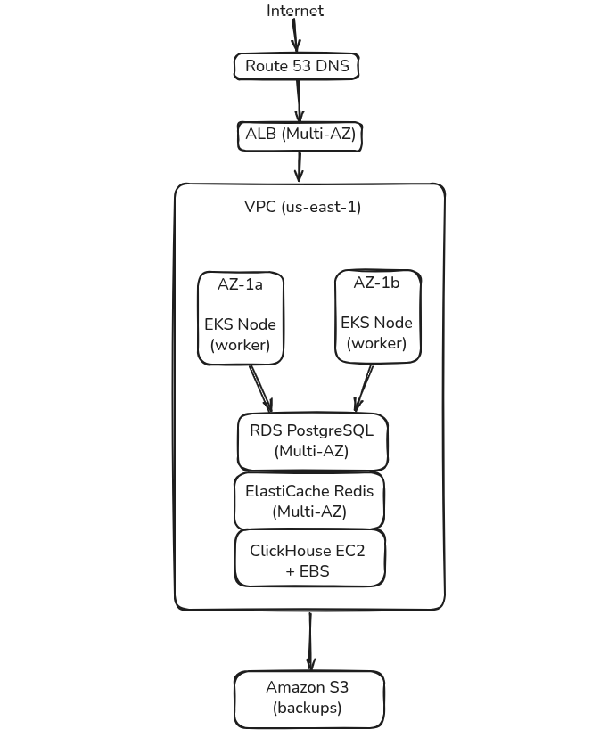

# Propuesta de Proyecto Final — OpenPanel

**Alumno:** Rubén López Solé

**Fecha:** Marzo 2026

**Especialidad:** GitOps

**Máster en DevOps & Cloud Computing**

---

## Resumen Ejecutivo

El objetivo de este proyecto es diseñar e implementar un flujo completo de DevOps para OpenPanel, una aplicación de analítica open-source. El proyecto busca demostrar cómo aplicar prácticas modernas de automatización, integración continua y despliegue continuo en un entorno basado en Kubernetes.

OpenPanel está compuesto por tres servicios y tres bases de datos, lo que introduce retos reales relacionados con el despliegue de aplicaciones distribuidas, la gestión de persistencia de datos y la observabilidad del sistema. Esta arquitectura lo convierte en un escenario adecuado para aplicar prácticas de DevOps en un entorno cercano a producción.

La estrategia principal adoptada en este proyecto es el enfoque GitOps utilizando ArgoCD. Bajo este modelo, toda la configuración de la infraestructura y de las aplicaciones se define de forma declarativa y versionada en Git, que actúa como fuente única de verdad. ArgoCD se encarga de sincronizar el estado del clúster con la configuración almacenada en el repositorio.

Como resultado, el sistema permitirá que cualquier cambio en el código siga un flujo de entrega completamente automatizado, donde la aplicación se construye, valida y despliega en Kubernetes de forma automática. El sistema estará acompañado de monitorización completa, alertas y mecanismos de backup, garantizando la fiabilidad y mantenibilidad de la plataforma.

---

## Qué es OpenPanel y cómo funciona

OpenPanel es una plataforma open-source de analítica web que permite a los usuarios recopilar y analizar eventos generados por sus aplicaciones, como visitas, clics o conversiones, y visualizar estos datos a través de dashboards interactivos.

Las aplicaciones envían eventos al API de OpenPanel, que actúa como punto de entrada para la ingesta de datos. Estos eventos posteriormente se almacenan y procesan para poder ser analizados y visualizados desde el dashboard web.

La plataforma sigue una arquitectura basada en múltiples servicios, donde cada componente tiene una responsabilidad clara dentro del sistema. Esta separación permite escalar los distintos componentes de forma independiente y facilita su despliegue en entornos distribuidos.

### Servicios de la Aplicación

OpenPanel está compuesto por tres servicios principales, cada uno responsable de una parte específica del sistema.

| Servicio | Qué hace |
|---|---|
| **Dashboard** | La web donde el usuario ve sus datos |
| **API** | Recibe los eventos y responde a las peticiones del dashboard |
| **Worker** | Procesa los datos en segundo plano (agregaciones, cálculos) |


### Componentes de Almacenamiento de Datos

| Base de datos | Para qué se usa |
|---|---|
| **PostgreSQL** | Almacena datos relacionales como usuarios, proyectos y configuraciones |
| **ClickHouse** | Almacena los eventos de analytics |
| **Redis** | Se utiliza como sistema de colas de trabajo y caché para el procesamiento asíncrono del Worker |


### Arquitectura del Sistema


La arquitectura de OpenPanel está diseñada para separar claramente la ingesta de datos, el almacenamiento y el procesamiento de eventos. Cuando una aplicación envía un evento, este llega al API Service, que actúa como punto de entrada para las peticiones de los clientes. La información se almacena en distintas bases de datos dependiendo del tipo de dato:

- PostgreSQL almacena datos relacionales como usuarios y configuraciones.

- ClickHouse almacena grandes volúmenes de eventos analíticos optimizados para consultas rápidas.

Para las tareas que requieren procesamiento en segundo plano, la API envía trabajos a Redis, que funciona como sistema de colas.

El Worker Service consume estos trabajos y ejecuta procesos como:

- agregación de eventos

- cálculo de métricas

- preparación de datos para consultas analíticas

Este modelo permite escalar de forma independiente la ingesta de eventos, el procesamiento de datos y la visualización, lo que facilita su despliegue en un entorno distribuido basado en Kubernetes.

---

### Entorno de Despliegue

La plataforma se desplegará en un clúster local de Kubernetes utilizando Minikube. Este entorno proporciona una forma ligera de simular una infraestructura similar a producción mientras el proyecto se mantiene autocontenido y reproducible.

El clúster alojará varios componentes necesarios para el flujo DevOps, incluyendo los servicios de la aplicación, herramientas de observabilidad, la gestión de despliegues mediante GitOps y los mecanismos de backup.

Para mantener el sistema organizado y facilitar su gestión, el clúster se estructurará utilizando namespaces de Kubernetes separados para las principales áreas funcionales, como los servicios de la aplicación, el stack de observabilidad, las herramientas de GitOps y la infraestructura de backups.

Se utilizará Ingress para exponer los servicios principales mediante URLs locales amigables, permitiendo el acceso al dashboard de la aplicación, la API y las herramientas de monitorización.


## Pipeline CI/CD y Estrategia de Despliegue con GitOps

### Flujo de Integración y Despliegue Continuo

El proyecto implementa un pipeline CI/CD completamente automatizado que construye, valida, asegura y despliega la aplicación OpenPanel en Kubernetes.

El flujo de trabajo está diseñado para garantizar que cada cambio enviado al repositorio sea validado automáticamente antes de llegar al clúster, siguiendo las mejores prácticas de DevOps en términos de fiabilidad, seguridad y reproducibilidad.

El pipeline integra GitHub Actions para la Integración Continua (CI) y ArgoCD para el Despliegue Continuo basado en GitOps (CD).

#### Flujo de trabajo CI/CD — Visión general


### Integración Continua (CI)

El pipeline de Integración Continua (CI), implementado utilizando GitHub Actions, se ejecuta automáticamente cada vez que se realiza un cambio en la rama main o cuando se abre un pull request.

El pipeline ejecuta varias validaciones automatizadas para garantizar que tanto el código de la aplicación como la configuración de la infraestructura cumplen con los estándares requeridos de calidad y seguridad antes del despliegue. Estas comprobaciones incluyen linting del código, validación de la infraestructura, escaneo de seguridad y construcción de imágenes de contenedor para los tres servicios que componen la aplicación.

#### Validación de la Aplicación

El código de la aplicación se valida mediante los siguientes pasos:

- Linting utilizando ESLint y Prettier para garantizar un estilo de código consistente y una buena calidad del mismo.

- Construcción de imágenes de contenedor para los tres servicios (API, Dashboard y Worker) con el fin de verificar que las imágenes Docker pueden construirse correctamente.

#### Validación de la Infraestructura

Para garantizar que la configuración de Kubernetes es válida y sigue las buenas prácticas, se ejecutan varias herramientas de validación como parte del pipeline:

- Kustomize build para verificar que los overlays generan manifiestos de Kubernetes válidos

- Kube-linter para detectar problemas de configuración y aplicar las buenas prácticas de Kubernetes

- kubectl dry-run para simular la aplicación de los manifiestos sin desplegarlos realmente

Estas comprobaciones permiten identificar errores de configuración de forma temprana, evitando que configuraciones inválidas o inseguras lleguen a la fase de despliegue.


### Despliegue Continuo (CD) con GitOps

El despliegue se gestiona utilizando ArgoCD, siguiendo un modelo GitOps en el que Git actúa como la única fuente de verdad para el estado del clúster. En lugar de enviar cambios directamente al clúster, el pipeline de CI actualiza la etiqueta de la imagen en los manifiestos de Kubernetes almacenados en Git. ArgoCD monitoriza continuamente el repositorio y sincroniza automáticamente el clúster cuando detecta un cambio.

- Este enfoque proporciona:

- Despliegues automatizados

- Versionado de la configuración

- Facilidad para realizar rollbacks

- Mayor seguridad en los despliegues

#### Estrategia de despliegue: Blue-Green

Para el servicio **API**, que es el componente más crítico del sistema, se utiliza una estrategia de despliegue **Blue-Green**.

Se mantienen dos versiones del deployment:

- **Blue** — versión actualmente en producción  
- **Green** — nueva versión candidata

Cuando se publica una nueva versión, esta se despliega primero en **Green**.  
Una vez verificado que el servicio funciona correctamente, el **Service de Kubernetes se actualiza para dirigir el tráfico hacia Green**. Si se detecta algún problema, el tráfico puede volver a la versión **Blue** simplemente cambiando el selector del Service, permitiendo un rollback casi inmediato.


### Estrategia de Versionado

El proyecto sigue Semantic Versioning (SemVer) para las versiones oficiales.

Las versiones de desarrollo utilizan etiquetas basadas en el commit, derivadas del Git SHA, para identificar de forma única cada imagen.

---

## Observabilidad 

Para entender cómo se comporta el sistema y detectar posibles problemas rápidamente, la plataforma incluirá un stack completo de observabilidad basado en los tres pilares de la observabilidad: **métricas**, **logs** y **trazas distribuidas**. En conjunto, estas señales proporcionan una visión clara de la salud y el rendimiento del sistema, facilitando la monitorización de la plataforma, la resolución de incidentes y la investigación de problemas cuando se producen.

### Stack de Observabilidad


Cada componente del stack de observabilidad cumple un papel diferente para proporcionar visibilidad sobre el sistema. Prometheus recopila métricas de la aplicación y de los componentes de Kubernetes, Loki agrega los logs de los pods en ejecución y Tempo captura trazas distribuidas para entender cómo fluyen las peticiones entre los distintos servicios. Grafana integra todas estas fuentes de datos y proporciona una interfaz unificada para la monitorización y el análisis.

| Pilar          | Herramienta     | Propósito                                                                                                      |
| -------------- | --------------- | -------------------------------------------------------------------------------------------------------------- |
| **Métricas**   | Prometheus      | Recoge métricas de series temporales como uso de CPU, consumo de memoria, tasa de peticiones y tasa de errores |
| **Logs**       | Loki + Promtail | Agrega los logs de todos los pods de Kubernetes en un sistema de logging centralizado                          |
| **Traces**     | Tempo           | Permite el *tracing* distribuido para seguir una petición a través de múltiples servicios                      |
| **Dashboards** | Grafana         | Proporciona paneles y visualización para métricas, logs y trazas                                               |


### Dashboard de Grafana

Se creará un dashboard unificado en Grafana con los siguientes paneles organizados por categoría:

**Aplicación:**

| Panel | Métrica | Visualización |
|---|---|---|
| Request rate (req/s) | `rate(http_requests_total[5m])` | Time series |
| Error rate (%) | `rate(http_requests_total{status=~"5.."}[5m])` | Time series + umbral rojo al 10% |
| Latencia P95 (ms) | `histogram_quantile(0.95, rate(http_request_duration_seconds_bucket[5m]))` | Time series |
| Cola del Worker | `llen(bull:default:wait)` vía Redis exporter | Gauge |

**Bases de datos:**

| Panel | Métrica | Visualización |
|---|---|---|
| Conexiones PostgreSQL activas | `pg_stat_activity_count` | Gauge |
| Memoria usada Redis | `redis_memory_used_bytes` | Time series |
| Eventos ClickHouse (total) | `clickhouse_table_parts_rows` | Stat |
| Tamaño datos ClickHouse | `clickhouse_table_parts_bytes` | Stat |

**Kubernetes:**

| Panel | Métrica | Visualización |
|---|---|---|
| CPU por pod | `rate(container_cpu_usage_seconds_total[5m])` | Time series (multi-serie) |
| Memoria por pod | `container_memory_working_set_bytes` | Time series (multi-serie) |
| Estado de pods | `kube_pod_status_phase` | Table |
| PVC utilización | `kubelet_volume_stats_used_bytes` | Gauge |

### Estrategia de Alertas y Umbrales

Las siguientes reglas de alerta se definirán en Prometheus para detectar incidentes de forma temprana:

| Alerta | Condición | Umbral | Duración |
|---|---|---|---|
| `HighErrorRate` | Más del 10% de peticiones HTTP retornan 5xx | `> 0.10` | 5 minutos |
| `HighMemoryUsage` | Un pod supera el límite de memoria | `> 900 MB` | 5 minutos |
| `APIDown` | El servicio API no responde al scrape de Prometheus | Sin datos | 1 minuto |
| `RedisDown` | El exporter de Redis no responde | Sin datos | 1 minuto |
| `PostgreSQLDown` | El exporter de PostgreSQL no responde | Sin datos | 1 minuto |

---

## Seguridad

### Gestión de Secrets — Sealed Secrets

En un enfoque GitOps, toda la configuración del sistema vive en Git, incluyendo los secrets. Sin embargo, almacenar contraseñas o tokens en texto plano en un repositorio es un riesgo de seguridad inaceptable. Para resolverlo, el proyecto utilizará **Sealed Secrets** de Bitnami.

Sealed Secrets permite cifrar los secrets de Kubernetes con la clave pública del clúster, de forma que el recurso cifrado (`SealedSecret`) puede almacenarse con seguridad en Git. Solo el controlador instalado en el clúster, que posee la clave privada correspondiente, puede descifrarlo y crear el `Secret` real de Kubernetes.

El flujo de trabajo es el siguiente:

1. Se crea el secret en local con `kubectl create secret --dry-run`
2. Se cifra con `kubeseal` usando la clave pública del clúster
3. El `SealedSecret` resultante se versiona en Git junto al resto de manifiestos
4. ArgoCD despliega el `SealedSecret` como cualquier otro recurso
5. El controlador lo descifra y crea el `Secret` en el namespace correspondiente

Este enfoque permite que **ArgoCD gestione todos los secrets como código declarativo**, manteniendo la coherencia del modelo GitOps sin exponer información sensible.

Los secrets que se gestionarán de esta forma son:

| Secret | Namespace | Contenido |
|---|---|---|
| `postgres-credentials` | `openpanel` | Usuario y contraseña de PostgreSQL |
| `redis-credentials` | `openpanel` | Contraseña de Redis |
| `clickhouse-credentials` | `openpanel` | Usuario y contraseña de ClickHouse |
| `openpanel-secrets` | `openpanel` | JWT secret de la aplicación |
| `grafana-admin-credentials` | `observability` | Credenciales de Grafana |
| `minio-credentials` | `backup` | Credenciales de acceso a MinIO |

Los tokens del pipeline de CI (acceso a GHCR, permisos de escritura en el repositorio) se gestionarán mediante **GitHub Secrets**, que son el mecanismo nativo de GitHub Actions para este propósito.

### Otras medidas de seguridad

| Medida | Descripción |
|---|---|
| **Contenedores non-root** | Ningún pod corre como root (`runAsNonRoot: true`, `readOnlyRootFilesystem: true`) |
| **Network Policies** | Modelo por defecto deny-all; solo se permiten las conexiones estrictamente necesarias entre servicios |
| **RBAC** | Cada componente tiene su propio ServiceAccount con permisos mínimos necesarios |
| **Image scanning** | Trivy en el pipeline de CI bloquea imágenes con vulnerabilidades críticas antes del despliegue |

---

## Infraestructura Cloud — Despliegue en AWS (Diseño Teórico)

Aunque la implementación del proyecto se realiza en local con Minikube, en esta sección se describe cómo se desplegaría la misma arquitectura en un entorno cloud real utilizando AWS, con alta disponibilidad y resiliencia.

### Equivalencia de componentes

| Componente local | Servicio AWS equivalente | Justificación |
|---|---|---|
| Minikube | **Amazon EKS** | Kubernetes gestionado con soporte multi-AZ |
| PostgreSQL (pod) | **Amazon RDS PostgreSQL** (Multi-AZ) | Alta disponibilidad con failover automático |
| Redis (pod) | **Amazon ElastiCache for Redis** (Multi-AZ) | Redis gestionado con replicación automática |
| ClickHouse (pod) | **EC2 + EBS** (r6i.large) | No existe servicio AWS gestionado; se desplegaría en instancias con almacenamiento optimizado |
| MinIO (pod) | **Amazon S3** | Almacenamiento de objetos nativo, sin necesidad de gestionar infraestructura |
| Ingress Controller | **AWS Load Balancer Controller + ALB** | Integración nativa con EKS para enrutamiento HTTP/HTTPS |
| GHCR | **Amazon ECR** | Registry privado integrado con IAM |
| Sealed Secrets | **AWS Secrets Manager + External Secrets Operator** | Alternativa cloud-native para la gestión de secrets en EKS |

### Diagrama de Alta Disponibilidad



### Estimación de Costes Mensuales (AWS us-east-1)

| Servicio | Configuración | Coste estimado/mes |
|---|---|---|
| Amazon EKS | Control plane | ~72 € |
| EC2 Worker Nodes | 2× t3.xlarge (4 vCPU, 16 GB) | ~230 € |
| RDS PostgreSQL | db.t3.medium Multi-AZ | ~95 € |
| ElastiCache Redis | cache.t3.micro | ~25 € |
| EC2 ClickHouse | r6i.large + 100 GB EBS gp3 | ~75 € |
| Amazon S3 | ~50 GB almacenamiento + transferencia | ~5 € |
| ALB | 1 balanceador + reglas | ~20 € |
| ECR | ~10 GB imágenes | ~3 € |
| **Total estimado** | | **~525 €/mes** |

> Esta estimación es orientativa para una carga de trabajo de desarrollo/staging. Un entorno de producción con mayor tráfico requeriría instancias más grandes y podría alcanzar los 800-1200 €/mes.

---

## Infraestructura como Código — Terraform

Para garantizar que la infraestructura de backups sea reproducible, versionada y auditable, se utilizará **Terraform** para declarar los recursos necesarios de almacenamiento y control de acceso.

### Alcance del módulo Terraform

El módulo Terraform cubrirá los recursos necesarios para que **Velero** pueda almacenar y recuperar backups de forma segura:

- Bucket S3 para el almacenamiento de backups
- Política de ciclo de vida del bucket (retención automática)
- IAM Role con permisos mínimos para Velero (acceso solo al bucket de backups)
- IAM Policy con las operaciones permitidas (`s3:GetObject`, `s3:PutObject`, `s3:DeleteObject`, `s3:ListBucket`)

### Estructura del módulo

```
terraform/
├── main.tf          # Bucket S3 y configuración de lifecycle
├── iam.tf           # IAM Role y Policy para Velero
├── variables.tf     # Variables configurables (nombre del bucket, región, retención)
└── outputs.tf       # ARN del Role y nombre del bucket para usar en Velero
```

### Ejemplo de uso

```hcl
module "velero_backup" {
  source         = "./terraform"
  bucket_name    = "openpanel-velero-backups"
  aws_region     = "us-east-1"
  retention_days = 30
}
```

> En el entorno local (Minikube), Velero apunta a MinIO como almacenamiento compatible con S3. El módulo Terraform define la infraestructura equivalente en AWS para un despliegue real.

---

## Plan de Trabajo y Estimación de Tiempos

El proyecto se estructura en siete fases secuenciales. Cada fase tiene dependencias claras con la anterior, siguiendo el orden lógico de construcción de la plataforma.

| Fase | Descripción | Tareas principales | Horas estimadas |
|---|---|---|---|
| **1. Infraestructura base** | Clúster Minikube, namespaces, Sealed Secrets, Terraform | Setup minikube, namespaces, Sealed Secrets controller, módulo Terraform S3/IAM | 10 h |
| **2. GitOps — ArgoCD** | Instalación y configuración de ArgoCD, Applications, Kustomize overlays | Instalar ArgoCD, crear AppProject, Application manifests, overlay local | 10 h |
| **3. Pipeline CI/CD** | GitHub Actions CI + CD, build de imágenes, push a GHCR | Workflows ci-validate.yml, ci-build-publish.yml y cd-update-tags.yml, matrix build api/start/worker, actualización automática de tags | 12 h |
| **4. Despliegue de la aplicación** | Manifiestos Kubernetes para los 6 componentes de OpenPanel | Deployments, Services, StatefulSets, ConfigMaps, PVCs, Ingress, NetworkPolicies | 12 h |
| **5. Estrategia Blue-Green** | Despliegue Blue-Green para la API con conmutación segura | Deployments blue/green, Service selector, script de conmutación con health checks | 8 h |
| **6. Observabilidad** | Stack completo: métricas, logs, trazas y dashboards | Prometheus + exporters, Loki + Promtail, Tempo, Grafana dashboards, reglas de alerta | 14 h |
| **7. Backup y recuperación** | Velero + MinIO, schedules automáticos, validación de restauración | MinIO deployment, Velero install, schedules diario/horario, script backup-restore, prueba de restauración | 8 h |
| **Documentación** | Documentación técnica completa del proyecto | ARCHITECTURE, SETUP, GITOPS, CICD, BLUE-GREEN, OBSERVABILITY, BACKUP, SECURITY, OPERATIONS, RUNBOOK | 10 h |
| **Total** | | | **84 h** |

### Cronograma aproximado

```
Semana 1:  Fase 1 (Infra base) + Fase 2 (GitOps)
Semana 2:  Fase 3 (CI/CD) + Fase 4 (Despliegue aplicación)
Semana 3:  Fase 5 (Blue-Green) + Fase 6 (Observabilidad)
Semana 4:  Fase 7 (Backup) + Documentación
```

---

